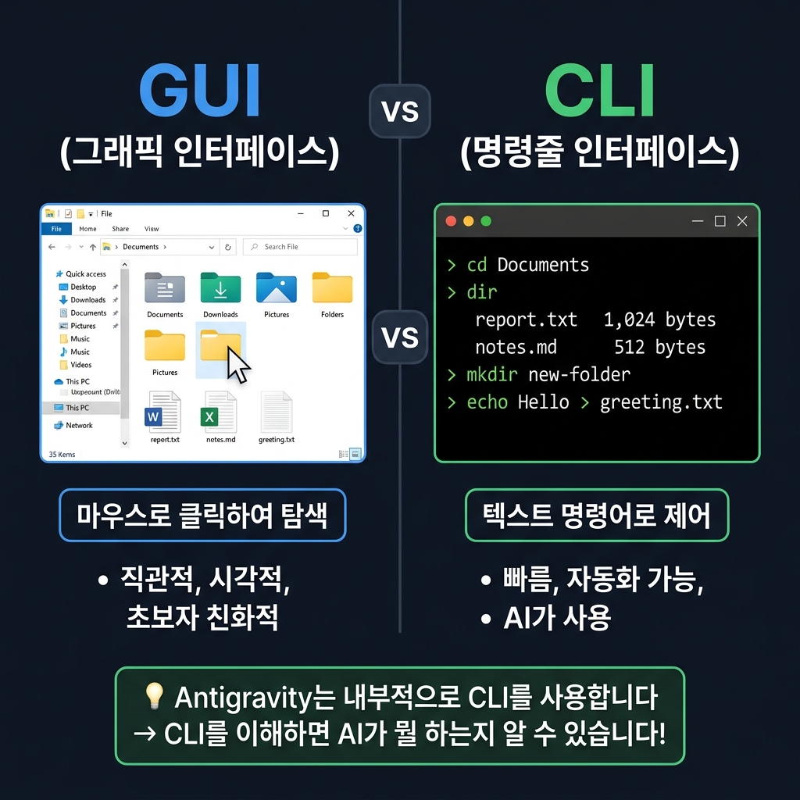
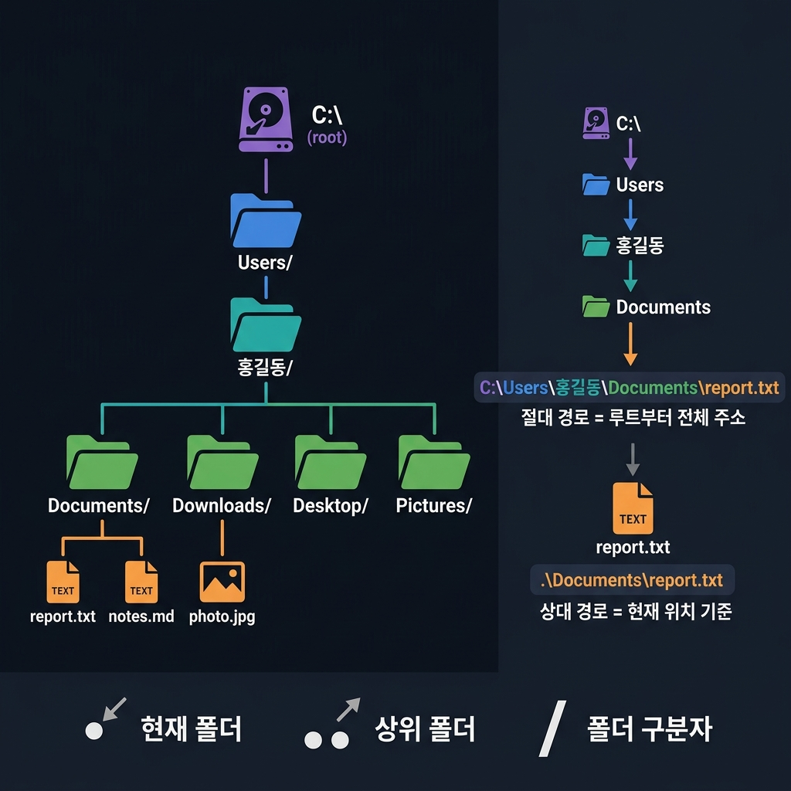

# 📌 2강: 터미널과 파일시스템 — 컴퓨터와 텍스트로 대화하기

> **핵심 포인트**: CLI(명령줄 인터페이스) 명령어와 경로(Path)의 개념

---

## 📖 이론 (20분)

### GUI vs CLI



여러분은 보통 마우스로 폴더를 더블클릭하여 파일을 열죠? 이것이 **GUI**(Graphical User Interface)입니다.

**CLI**(Command Line Interface)는 텍스트로 같은 일을 합니다:
- **GUI**: 내 문서 폴더를 더블클릭 → 파일 보기
- **CLI**: `cd Documents` → `dir` (또는 `ls`)

#### 왜 CLI를 알아야 하나?

- Antigravity는 내부적으로 **CLI 명령어를 실행**합니다
- AI가 뭘 하고 있는지 이해하려면 기본 명령어를 알아야 합니다
- 많은 개발 도구가 CLI로 동작합니다

### 핵심 명령어 (Windows)

| 명령어 | 의미 | 예시 |
|--------|------|------|
| `dir` | 현재 폴더 내용 보기 | `dir` |
| `cd` | 폴더 이동 | `cd Documents` |
| `cd ..` | 상위 폴더로 | `cd ..` |
| `mkdir` | 폴더 생성 | `mkdir my-project` |
| `type` | 파일 내용 보기 | `type hello.txt` |
| `echo` | 텍스트 출력/파일 저장 | `echo 안녕 > hi.txt` |
| `del` | 파일 삭제 | `del temp.txt` |
| `copy` | 파일 복사 | `copy a.txt backup/` |

### 경로(Path)란?



파일의 **주소**입니다. 집 주소처럼 정확한 위치를 알려줍니다.

- **절대 경로**: `C:\Users\홍길동\Documents\report.txt` — 루트부터 전체 주소
- **상대 경로**: `./Documents/report.txt` — 지금 위치 기준
- `.` = 현재 폴더 / `..` = 한 단계 위 폴더 / `/` 또는 `\` = 폴더 구분자

---

## 🔨 가이드 실습 (25분)

### 실습 1: Antigravity에게 폴더 구조 만들기 (10분)

```
practice라는 폴더를 만들고, 그 안에 
day1, day2, day3 폴더를 만들어줘.
각 폴더 안에 notes.txt 파일을 만들고
"Day X 학습 노트"라고 적어줘.
```

**관찰 포인트**: Antigravity가 어떤 명령어를 사용했는지 살펴보세요.

### 실습 2: 폴더 탐색 해보기 (10분)

```
방금 만든 practice 폴더의 전체 구조를 트리 형태로 보여줘.
각 파일의 크기도 함께 보여줘.
```

직접도 해보세요:
```
현재 폴더에서 txt 파일만 모두 찾아줘.
```

### 실습 3: 파일 조작 스크립트 (5분)

```
practice 폴더 안의 모든 notes.txt 파일을 읽어서
내용을 하나의 파일(all-notes.txt)로 합쳐줘.
JavaScript와 Python 둘 다 해줘.
```

**관찰 포인트**: AI가 파일을 읽고, 합치고, 새 파일로 저장하는 과정을 살펴보세요.

---

## 🎯 자율 실습 (25분)

[TOPIC_POOL.md](TOPIC_POOL.md)에서 마음에 드는 주제를 골라 도전해보세요!

**이번 강의 추천 주제**: 🟢 폴더 트리 시각화, 🟡 파일명 일괄 변경

---

## ✅ 이번 강의 체크리스트

- [ ] 터미널에서 기본 명령어(dir, cd, mkdir)를 이해했다
- [ ] 절대 경로와 상대 경로의 차이를 이해했다
- [ ] Antigravity에게 폴더/파일 생성을 요청할 수 있다
- [ ] AI가 사용한 명령어를 확인하고 이해할 수 있다

---

## 🔗 다음 강의

[3강: 파일의 세계](../L03_파일의_세계/README.md) — 파일 확장자와 인코딩 이해하기
