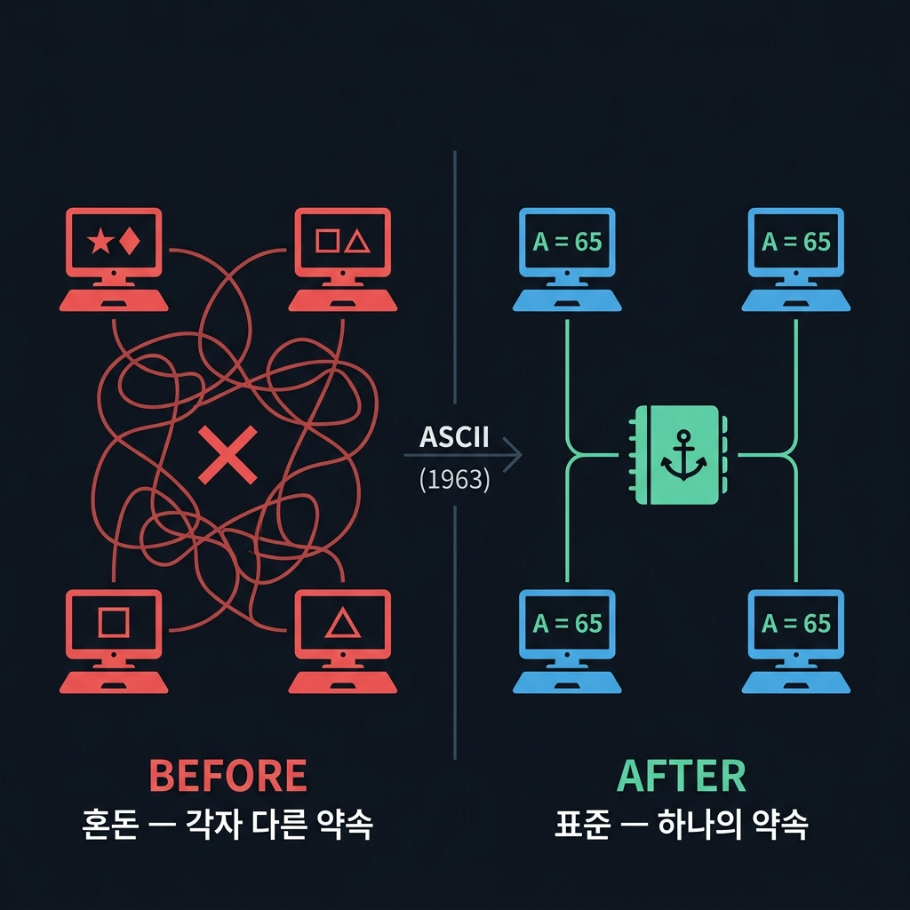
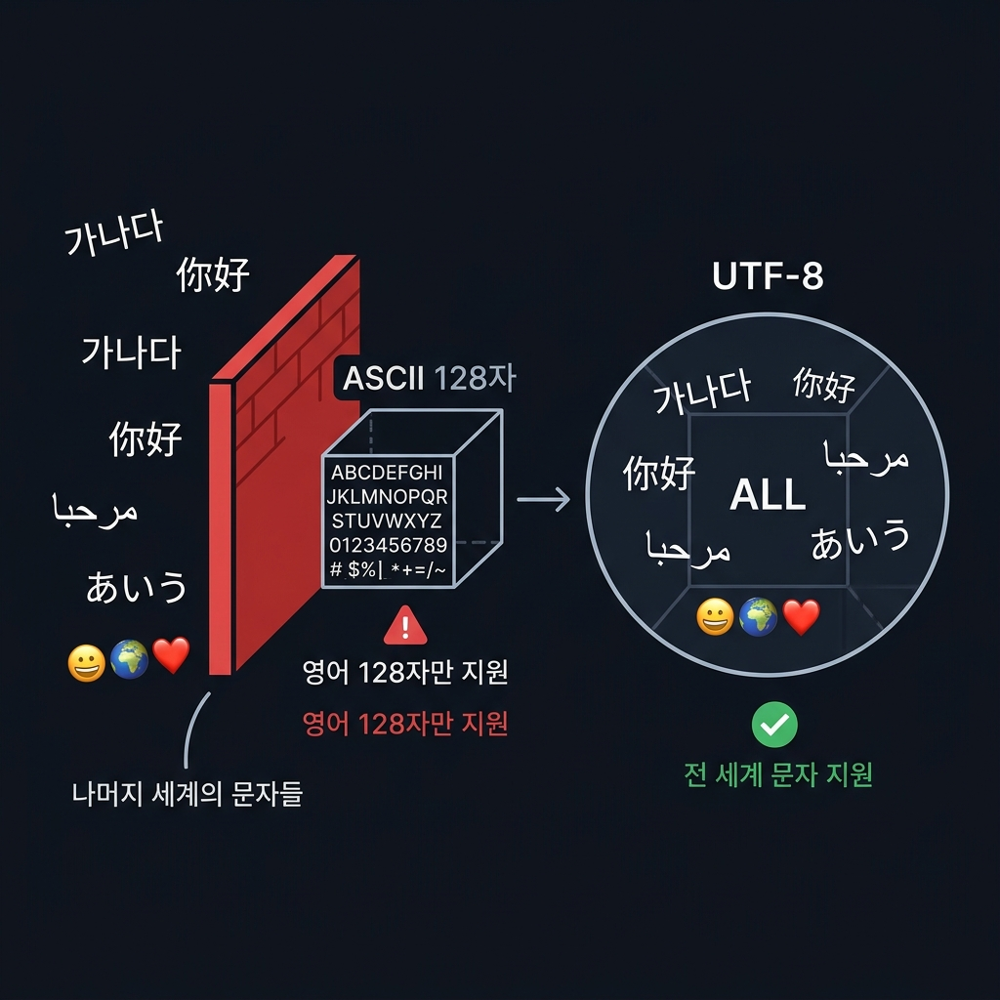
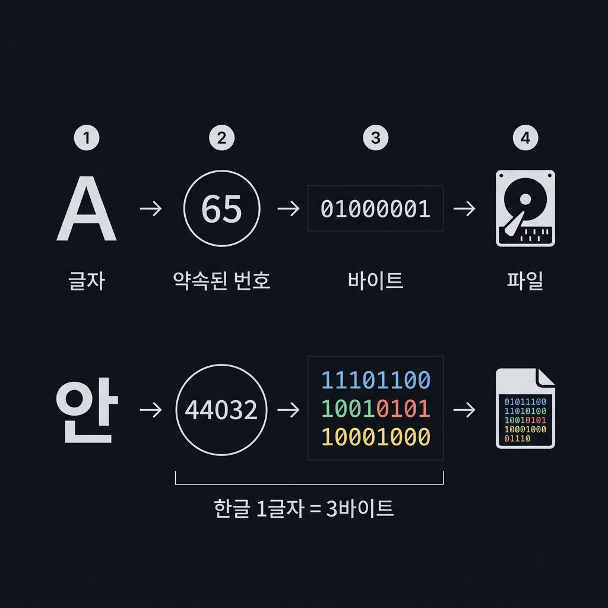
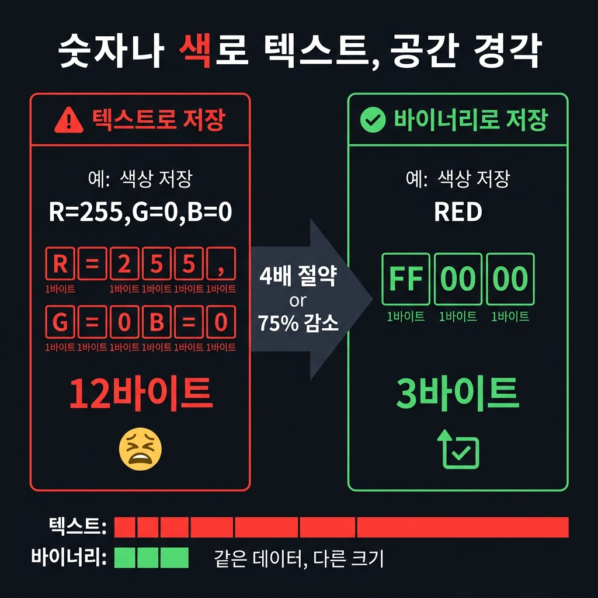
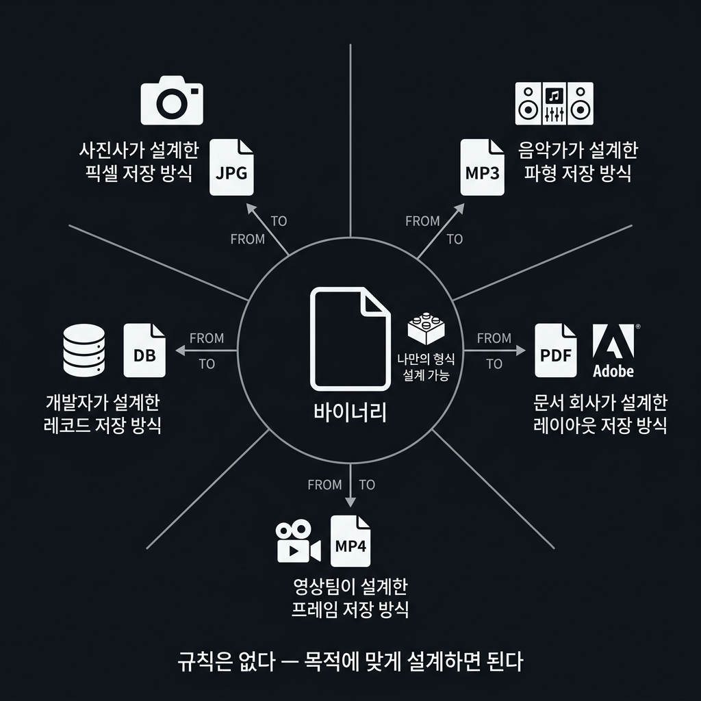
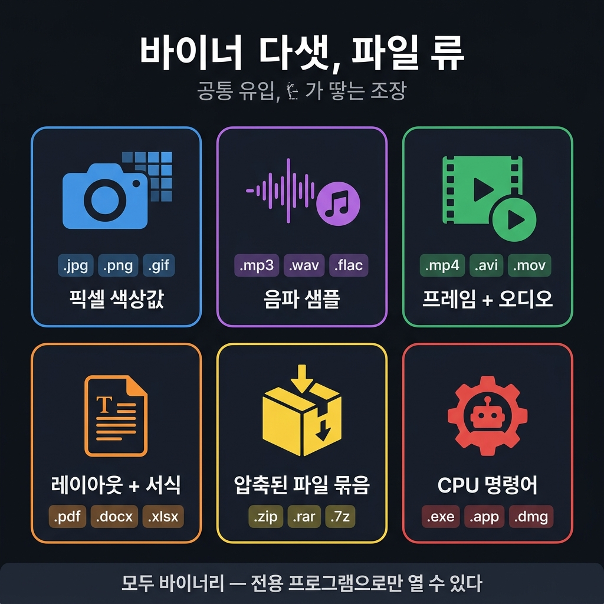

# 📌 3강: 파일의 세계 — 데이터 저장의 진화

> **핵심 포인트**: ASCII가 탄생한 이유부터 바이너리 파일이 필요한 이유까지 — 컴퓨터가 데이터를 저장하는 방법의 역사적 흐름

---

## 📖 이론 (20분)

### 1. 표준화 문제 — ASCII는 왜 만들어졌을까?

초기 컴퓨터 시대, 모든 제조사가 **제각기 다른 방식으로 문자를 저장**했습니다.
IBM은 IBM대로, 다른 회사는 또 다른 방식으로. 컴퓨터끼리 파일을 주고받으면 글자가 뒤죽박죽이 됐습니다.

> 💡 **문제**: 'A'라는 글자를 숫자 65로 저장하기로 합의한 사람이 아무도 없었다.

1963년, 미국은 **ASCII**(American Standard Code for Information Interchange)를 발표합니다.
영문자, 숫자, 특수문자 128개에 국제 표준 번호를 부여한 **최초의 약속**입니다.



---

### 2. ASCII의 한계 — 128자로는 세계를 담을 수 없다

ASCII는 영어권에서는 훌륭했지만, 치명적인 문제가 있었습니다.
**128개의 번호**로는 한국어(11,172자), 중국어(수만 자), 아랍어, 이모지를 담을 방법이 없었습니다.

각 나라가 자국 언어용으로 독자적인 인코딩을 만들기 시작했고(한국의 EUC-KR, 일본의 Shift-JIS 등),
인터넷이 발달하면서 **다시 혼돈**이 찾아왔습니다.

> ⚠️ 글자가 `???` 또는 `?몄슂`처럼 깨지는 건 **인코딩이 불일치**해서입니다.

해결책은 **UTF-8** — 전 세계 모든 문자를 하나의 표준으로 지원하는 인코딩입니다.



| 인코딩 | 지원 범위 | 현재 |
|--------|----------|------|
| ASCII | 영문 128자 | 레거시 |
| EUC-KR | 한국어 전용 | 일부 구형 시스템 |
| **UTF-8** | **전 세계 모든 문자** | **현재 표준** ✅ |

---

### 3. 텍스트 파일 — 글자를 숫자로 저장하다

UTF-8 덕분에 이제 어떤 글자든 **약속된 번호(코드 포인트)** 로 변환하여 파일에 저장할 수 있습니다.

- 영문 `A` → 코드 65 → `01000001` (1바이트)
- 한글 `안` → 코드 44032 → 3바이트 (`EC 95 88`)
- 이모지 `😀` → 코드 128512 → 4바이트

코드 편집기, 메모장, `.txt`, `.md`, `.csv`, `.js`, `.py` — 이 모든 파일이 **텍스트 파일**입니다.
메모장으로 열면 읽을 수 있는 것이 바로 이 원리입니다.



---

### 4. 텍스트로만 저장하면 비효율적이다 → 바이너리

텍스트 파일은 사람이 읽을 수 있다는 장점이 있지만, **숫자 데이터를 글자로 표현하면 공간이 심하게 낭비**됩니다.

예시: 빨간색 픽셀 1개를 저장할 때
- **텍스트 방식**: `"R=255,G=0,B=0"` → 글자 13개 → **13바이트**
- **바이너리 방식**: `FF 00 00` → **3바이트**

사진 한 장에 수백만 픽셀이 있다면? **텍스트로 저장하면 파일이 4배 이상 커집니다.**

> 💡 이것이 이미지, 음악, 영상이 텍스트 파일이 아닌 **바이너리 파일**로 저장되는 이유입니다.



---

### 5. 바이너리는 자유롭다 — 목적에 맞게 설계

바이너리 파일에는 정해진 형식이 없습니다.
**누구든 자신의 데이터에 가장 효율적인 방식으로 형식을 설계할 수 있습니다.**

- 카메라 회사가 픽셀을 가장 효율적으로 저장하는 방식을 설계 → JPG
- 음악 녹음사가 음파 데이터를 압축하는 방식을 설계 → MP3
- 어도비가 문서 레이아웃을 보존하는 방식을 설계 → PDF

바이너리 파일의 규칙은 딱 하나 — **파일을 만든 사람이 규칙을 정한다.**
그래서 전용 프로그램이 없으면 열 수 없고, 메모장으로 열면 깨집니다.



---

### 6. 대표적인 바이너리 파일들

| 종류 | 저장하는 것 | 대표 확장자 |
|------|------------|------------|
| 이미지 | 픽셀의 RGB 색상값 | `.jpg` `.png` `.gif` |
| 음악 | 음파 샘플 데이터 | `.mp3` `.wav` `.flac` |
| 영상 | 프레임(사진) + 오디오 | `.mp4` `.avi` `.mov` |
| 문서 | 텍스트 + 레이아웃 + 서식 | `.pdf` `.docx` `.xlsx` |
| 압축 | 다른 파일들의 압축 묶음 | `.zip` `.rar` `.7z` |
| 실행파일 | CPU가 실행할 명령어 | `.exe` `.app` |



> 💡 **매직 넘버**: 바이너리 파일은 첫 몇 바이트에 자신의 종류를 명시합니다.
> - JPG는 항상 `FF D8 FF`로 시작
> - PNG는 항상 `89 50 4E 47`로 시작
> - PDF는 항상 `25 50 44 46`(= `%PDF`)로 시작

---

## 🔨 가이드 실습 (25분)

### 실습 1: 텍스트 vs 바이너리 직접 확인 (10분)

```
1. 메모장으로 .txt 파일 하나를 만들어 "안녕Hi!"라고 저장해줘
2. 같은 텍스트를 저장했을 때 파일 크기(바이트)를 계산해줘
3. 아무 .jpg 이미지 파일을 메모장으로 열면 어떻게 보이는지 설명해줘
```

### 실습 2: 인코딩 체험 (15분)

```
Python으로:
1. "안녕Hi!"를 UTF-8로 인코딩하면 몇 바이트인지 출력해줘
2. 각 글자가 몇 바이트씩 차지하는지 글자별로 출력해줘
3. 같은 문자열을 이진수(01)로 시각화해서 출력해줘
```

---

## 🎯 자율 실습 (25분)

[TOPIC_POOL.md](TOPIC_POOL.md)에서 주제를 골라 도전!

**이번 강의 추천 주제**: 🟢 파일 확장자 탐정, 🟡 나만의 바이너리 형식 설계

---

## ✅ 이번 강의 체크리스트

- [ ] ASCII가 만들어진 이유(표준화)를 설명할 수 있다
- [ ] ASCII의 한계와 UTF-8이 해결한 문제를 알고 있다
- [ ] 텍스트 파일이 어떻게 저장되는지 이해했다
- [ ] 바이너리 파일이 필요한 이유(효율)를 설명할 수 있다
- [ ] 주요 바이너리 파일 종류와 특징을 안다

---

## 🔗 다음 강의

[4강: 프롬프트 엔지니어링](../L04_프롬프트_엔지니어링/README.md) — AI에게 잘 부탁하는 법
