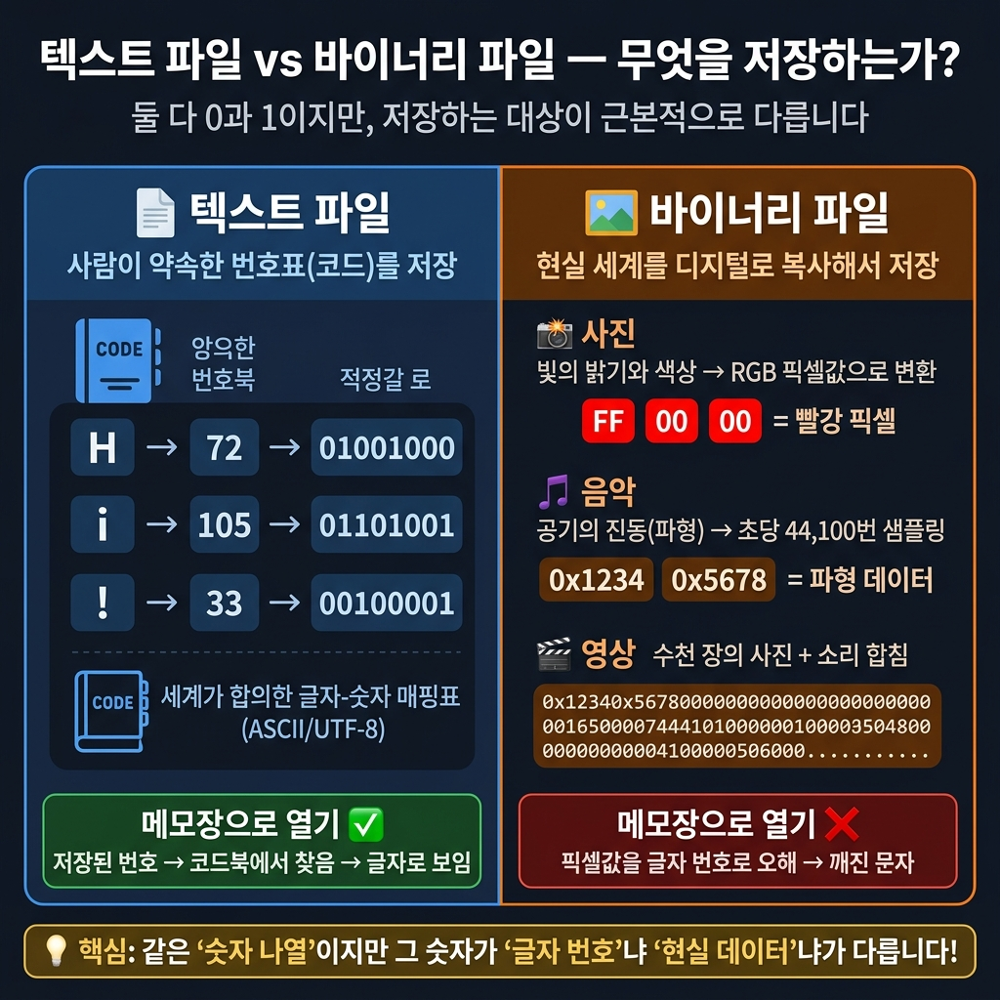
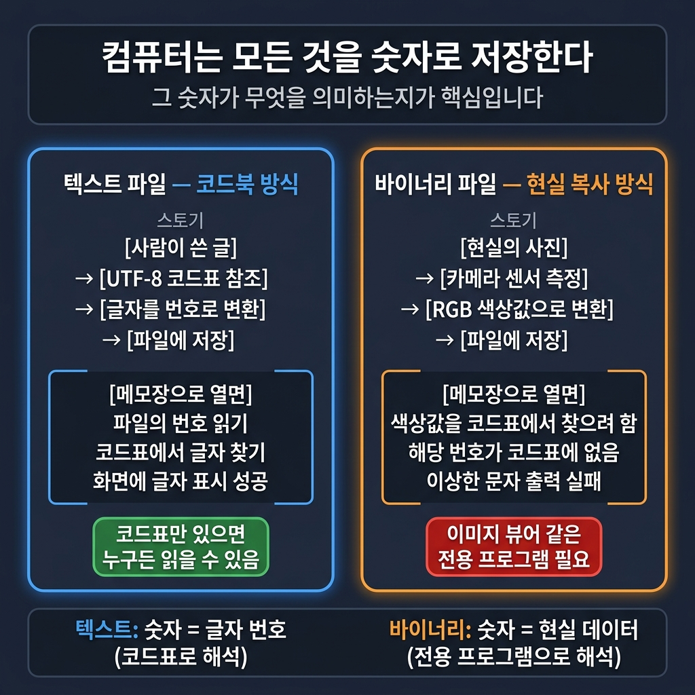
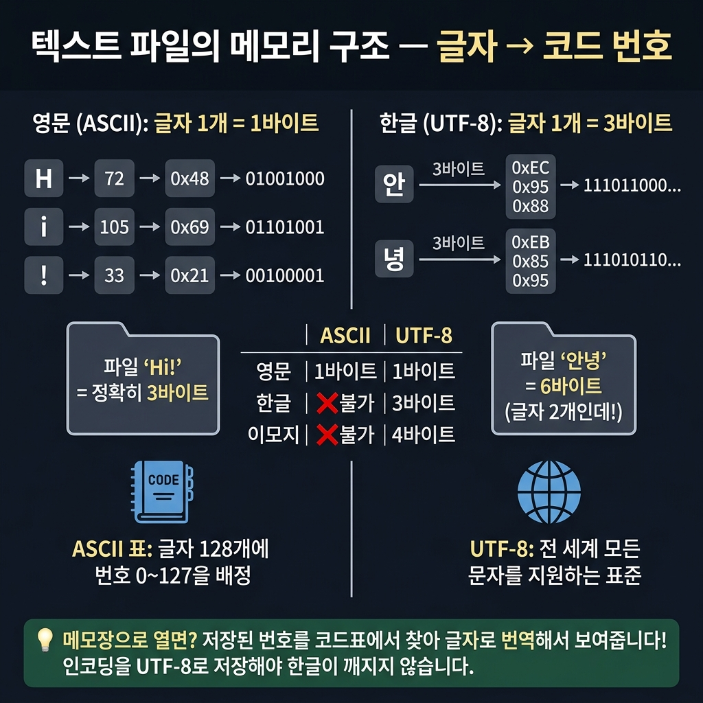
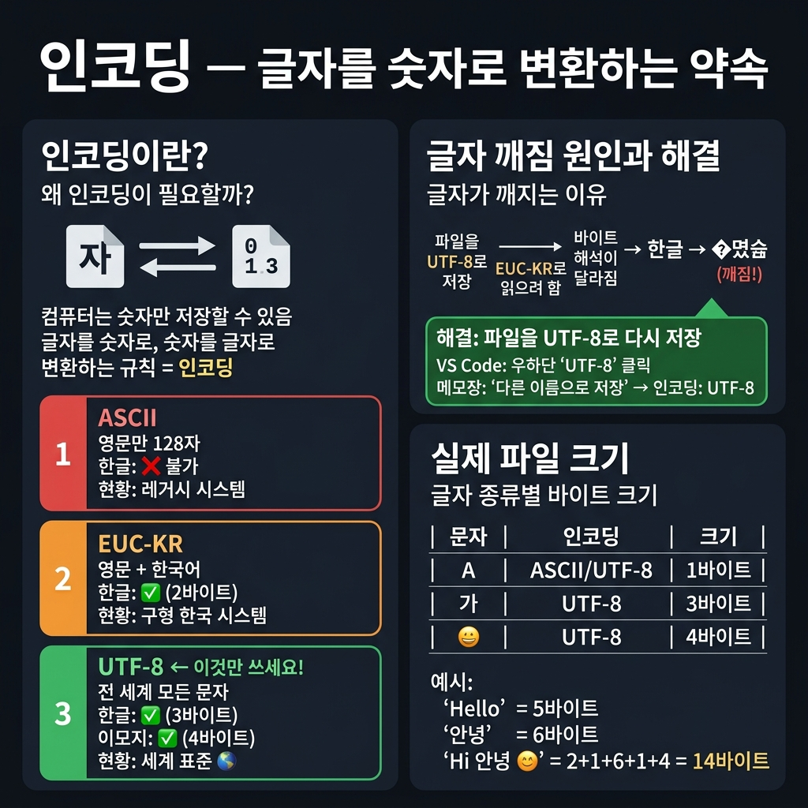
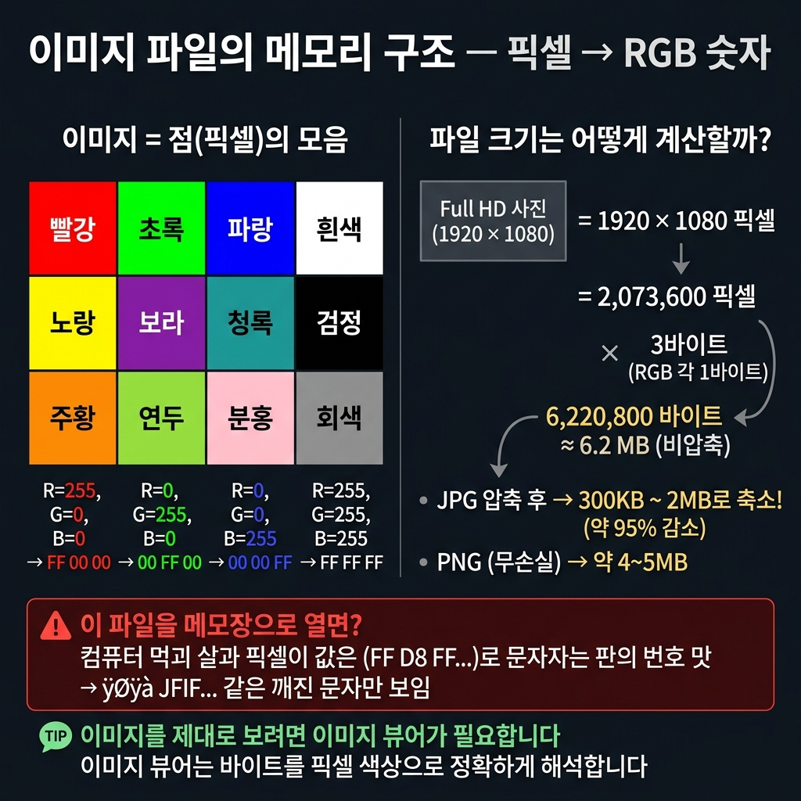
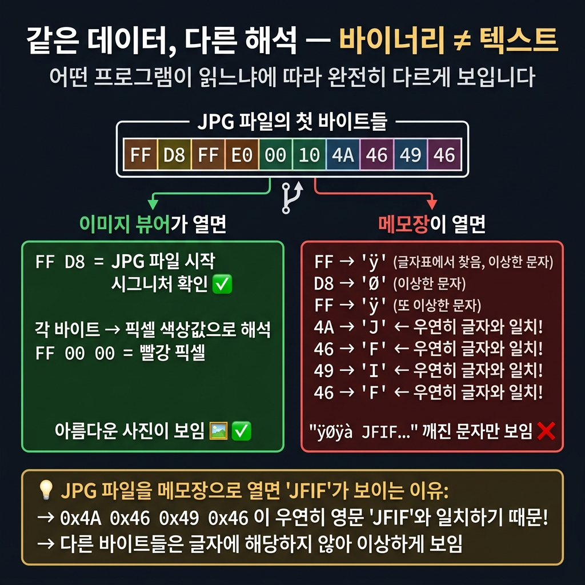
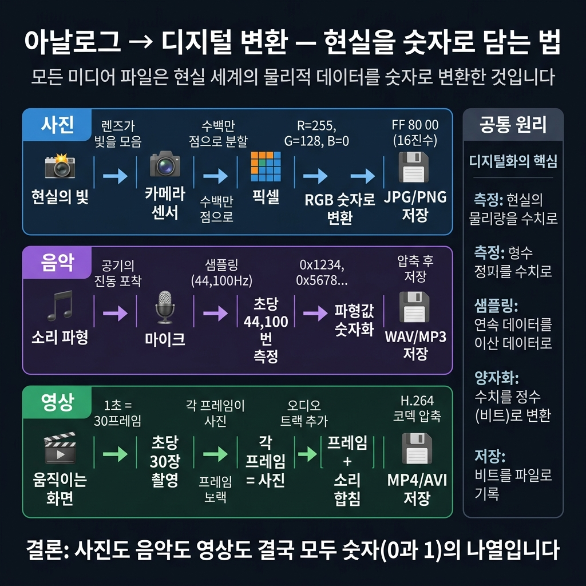
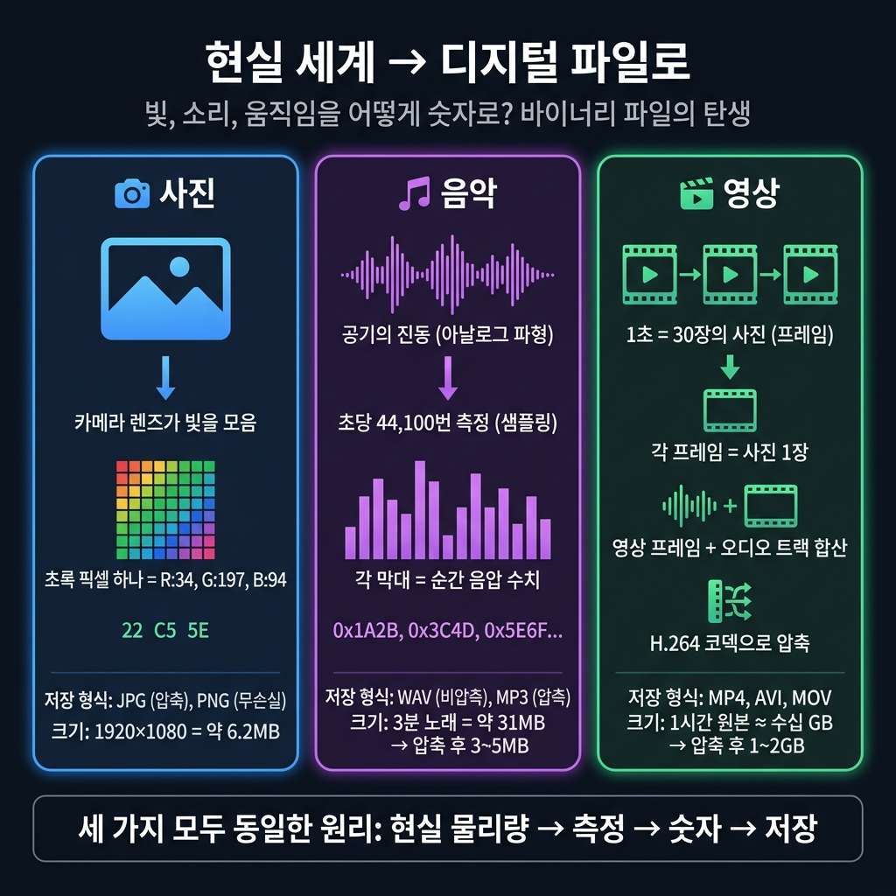
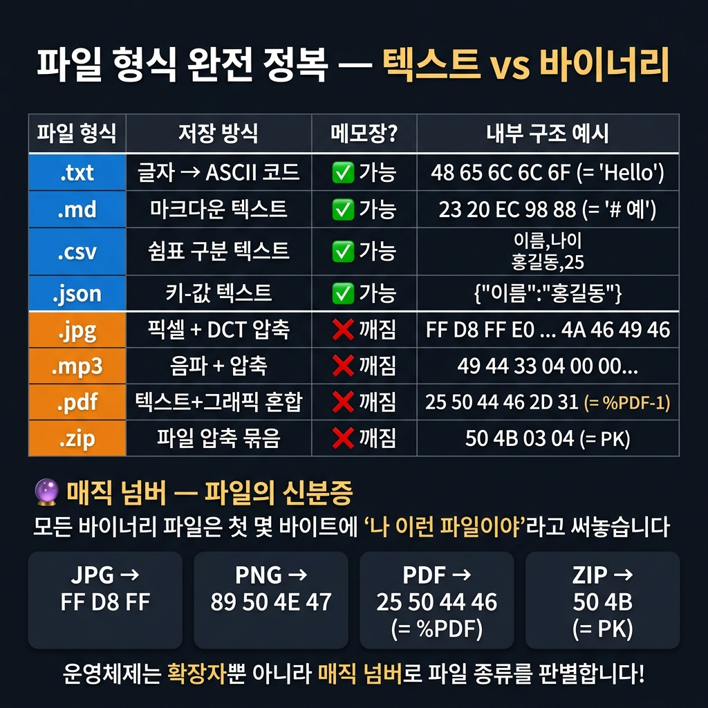
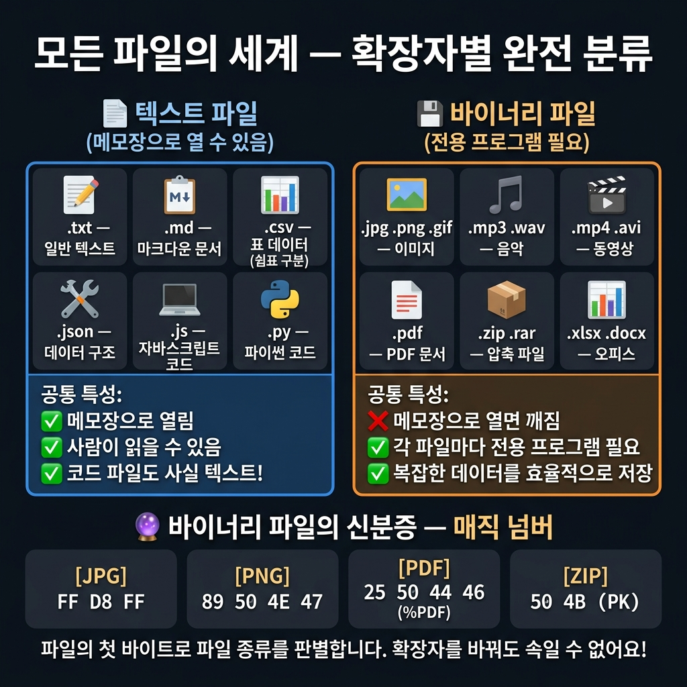

# 📌 3강: 파일의 세계 — 확장자, 인코딩, 그리고 포맷

> **핵심 포인트**: 파일 확장자의 의미, 텍스트 vs 바이너리, 인코딩(UTF-8)의 개념

---

## 📖 이론 (20분)

### 파일이란?

컴퓨터에 저장된 **데이터 덩어리**입니다. 모든 파일은 결국 0과 1의 나열이지만, **확장자**가 "이 데이터를 어떻게 읽어야 하는지" 알려줍니다.

### 확장자별 분류

| 종류 | 확장자 | 특징 |
|------|--------|------|
| 텍스트 | `.txt`, `.md`, `.csv` | 메모장으로 읽을 수 있음 |
| 코드 | `.js`, `.py`, `.html`, `.css` | 프로그래밍 언어 파일 (텍스트!) |
| 데이터 | `.json`, `.xml`, `.yaml` | 구조화된 텍스트 데이터 |
| 이미지 | `.jpg`, `.png`, `.gif` | 바이너리 (메모장으로 안 열림) |
| 문서 | `.pdf`, `.docx`, `.xlsx` | 바이너리 (전용 프로그램 필요) |

> ⚡ 핵심: **코드 파일도 결국 텍스트 파일**입니다! `.js`나 `.py`는 메모장으로 열 수 있습니다.

### 인코딩이란?

텍스트를 0과 1로 변환하는 **약속(규칙)**입니다.

- **UTF-8**: 전 세계 표준. 한국어, 영어, 이모지 모두 지원 → **이것만 기억하세요!**
- **EUC-KR**: 한국어 전용 옛날 방식. 가끔 "???" 글자 깨짐의 원인
- **ASCII**: 영어만 지원하는 가장 기본 인코딩

```
글자 깨짐이 발생하면 → 인코딩 문제일 가능성 높음!
해결: "이 파일을 UTF-8로 다시 저장해줘"
```

### 텍스트 파일 vs 바이너리 파일 — 메모리에서 어떻게 생겼을까?

둘 다 결국 0과 1의 나열이지만, **저장하는 대상 자체가 근본적으로 다릅니다.**





> 💡 **텍스트 파일**은 "사람이 약속한 번호표(코드)"를 저장하고,
> **바이너리 파일**은 "현실 세계(빛, 소리, 움직임)를 디지털로 복사"한 것입니다.

---

#### 📄 텍스트 파일: 글자 → ASCII/UTF-8 코드값





- 영문 글자 1개 = **1바이트** (예: `"Hi!"` = 3바이트)
- 한글 글자 1개 = **3바이트** (예: `"안녕"` = 6바이트)
- 메모장으로 열면 컴퓨터가 이 숫자를 다시 글자로 **번역**해서 보여줍니다

---

#### 🖼️ 이미지 파일: 픽셀 → RGB 색상값



- 이미지 = **점(픽셀)의 모음**, 각 픽셀은 R(빨강), G(초록), B(파랑) 3가지 값으로 구성
- 1픽셀 = 3바이트 → Full HD 사진(1920×1080) = 약 6.2MB (비압축)
- JPG로 압축하면 약 300KB ~ 2MB로 줄어듦
- 이 파일을 메모장으로 열면? → `ÿØÿà JFIF ÿÛ C...` 같은 깨진 문자열만 보임!

#### ⚠️ 바이너리를 텍스트로 열면? — 같은 데이터, 엉뚱한 해석




같은 바이트 데이터라도 **어떤 프로그램이 읽느냐**에 따라 완전히 다르게 해석됩니다:
- **이미지 뷰어**가 읽으면 → 바이트를 **픽셀 색상**으로 해석 → 사진이 보임 ✅
- **메모장**이 읽으면 → 바이트를 **글자 번호표(ASCII)**에서 찾음 → 깨진 문자 ❌

> 💡 `FF D8 FF E0` 같은 픽셀 데이터를 글자 표에서 찾으면 `ÿØÿà` 가 됩니다.
> 하지만 `4A 46 49 46`은 우연히 `JFIF` 라는 글자와 일치합니다!
> 이것이 바로 JPG 파일을 메모장으로 열면 간혹 "JFIF" 같은 읽을 수 있는 조각이 보이는 이유입니다.

---

#### 🔄 아날로그 → 디지털 변환 과정

사진, 음악, 영상은 모두 **현실의 물리량을 측정하여 숫자로 변환**하는 동일한 원리로 만들어집니다.





---

#### 🎵 음악 파일: 소리 → 파형 → 숫자

소리는 **공기의 진동(파형)**입니다. 이 파형을 초당 44,100번 측정(샘플링)하여 숫자로 기록합니다.

- 1초 분량 = 44,100 샘플 × 2바이트 × 2채널(스테레오) = **약 176KB**
- 3분 노래 = 약 31MB (비압축 WAV) → MP3 압축 후 **약 3~5MB**

---

#### 📦 파일 형식 비교 총정리





> 💡 **매직 넘버**: 바이너리 파일의 첫 몇 바이트를 보면 파일 종류를 알 수 있습니다!
> - JPG는 항상 `FF D8 FF`로 시작
> - PNG는 항상 `89 50 4E 47`로 시작
> - PDF는 항상 `25 50 44 46`(= `%PDF`)로 시작
> - ZIP은 항상 `50 4B`(= `PK`)로 시작

---

## 🔨 가이드 실습 (25분)

### 실습 1: 다양한 형식 파일 만들기 (10분)

```
다음 4가지 파일을 만들어줘:
1. memo.txt — "오늘의 할 일: 바이브코딩 배우기"
2. data.csv — 이름, 나이, 도시 3명 분량의 표 데이터
3. config.json — 앱 이름, 버전, 다크모드 여부를 담은 설정 파일
4. profile.md — 내 이름과 취미를 마크다운으로 정리한 자기소개
```

각 파일을 메모장과 VS Code로 열어보며 차이를 비교해보세요.

### 실습 2: 파일 읽기 프로그램 (10분)

```
방금 만든 4개 파일을 전부 읽어서
각 파일의 이름, 확장자, 크기(바이트), 첫 줄을
깔끔한 표로 출력하는 프로그램을 만들어줘. JS와 Python 둘 다.
```

### 실습 3: 인코딩 체험 (5분)

```
"안녕하세요 🌍" 라는 텍스트를 UTF-8과 ASCII로 각각 저장해보고
어떤 차이가 있는지 알려줘.
```

---

## 🎯 자율 실습 (25분)

[TOPIC_POOL.md](TOPIC_POOL.md)에서 주제를 골라 도전해보세요!

**이번 강의 추천 주제**: 🟢 마크다운 자기소개 작성, 🟡 CSV↔JSON 변환기

---

## ✅ 이번 강의 체크리스트

- [ ] 주요 파일 확장자의 역할을 이해했다
- [ ] 텍스트 파일과 바이너리 파일의 차이를 안다
- [ ] UTF-8 인코딩이 무엇인지 안다
- [ ] 다양한 형식의 파일을 AI에게 요청하여 생성할 수 있다

---

## 🔗 다음 강의

[4강: 프롬프트 엔지니어링](../L04_프롬프트_엔지니어링/README.md) — AI에게 잘 부탁하는 법
