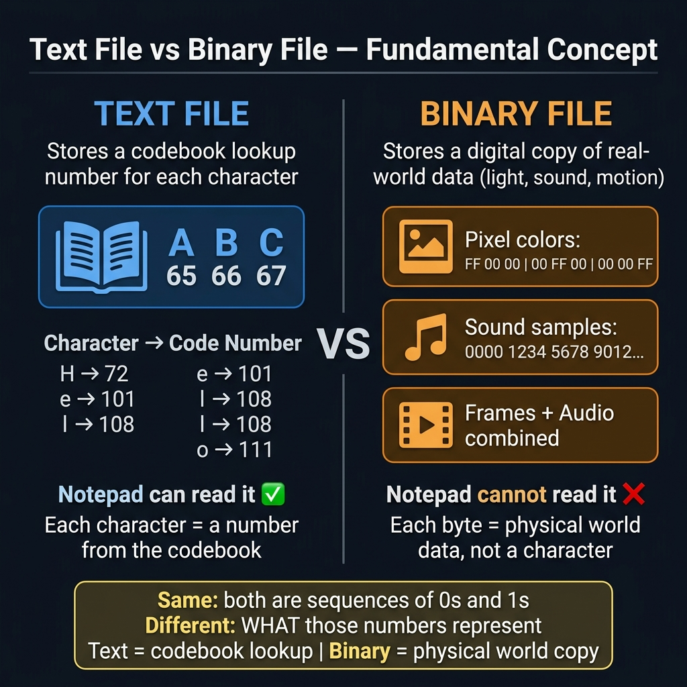
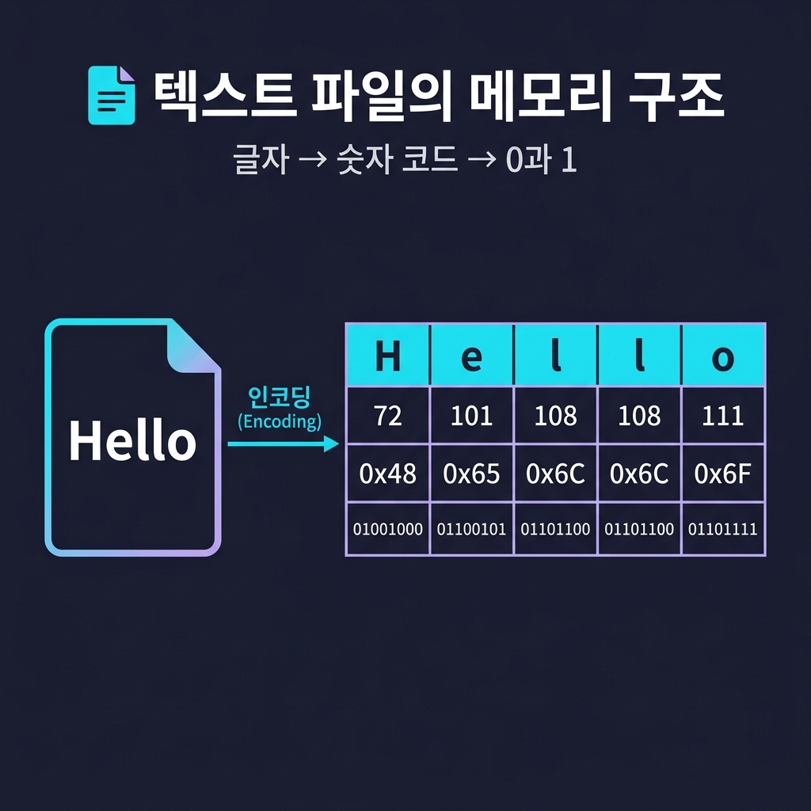
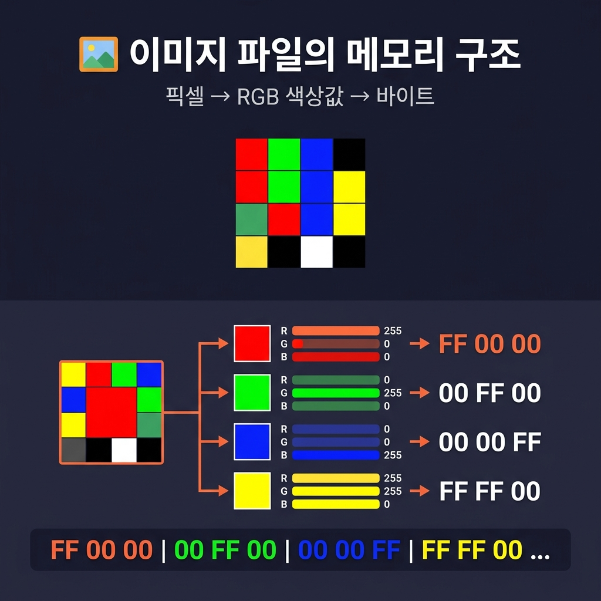
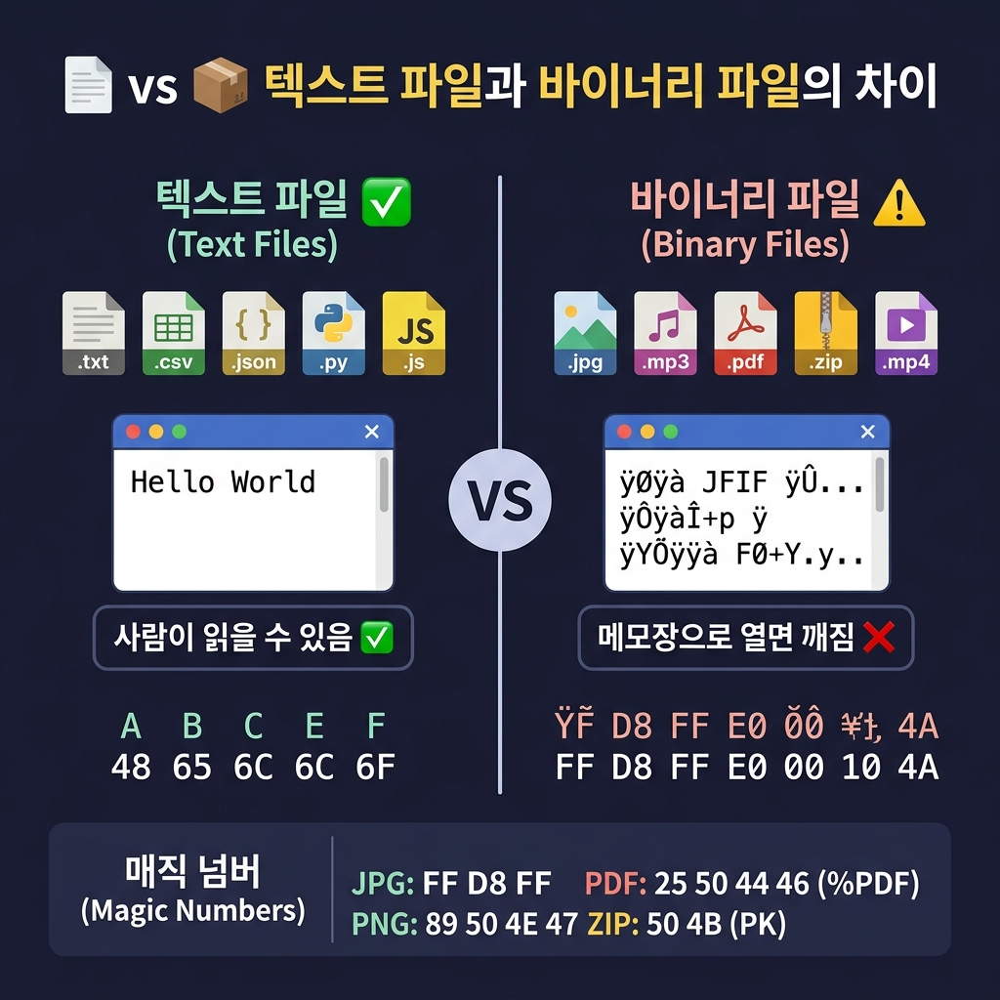

# 📌 3강: 파일의 세계 — 확장자, 인코딩, 그리고 포맷

> **핵심 포인트**: 파일 확장자의 의미, 텍스트 vs 바이너리, 인코딩(UTF-8)의 개념

---

## 📖 이론 (20분)

### 파일이란?

컴퓨터에 저장된 **데이터 덩어리**입니다. 모든 파일은 결국 0과 1의 나열이지만, **확장자**가 "이 데이터를 어떻게 읽어야 하는지" 알려줍니다.

### 확장자별 분류

| 종류 | 확장자 | 특징 |
|------|--------|------|
| 텍스트 | `.txt`, `.md`, `.csv` | 메모장으로 읽을 수 있음 |
| 코드 | `.js`, `.py`, `.html`, `.css` | 프로그래밍 언어 파일 (텍스트!) |
| 데이터 | `.json`, `.xml`, `.yaml` | 구조화된 텍스트 데이터 |
| 이미지 | `.jpg`, `.png`, `.gif` | 바이너리 (메모장으로 안 열림) |
| 문서 | `.pdf`, `.docx`, `.xlsx` | 바이너리 (전용 프로그램 필요) |

> ⚡ 핵심: **코드 파일도 결국 텍스트 파일**입니다! `.js`나 `.py`는 메모장으로 열 수 있습니다.

### 인코딩이란?

텍스트를 0과 1로 변환하는 **약속(규칙)**입니다.

- **UTF-8**: 전 세계 표준. 한국어, 영어, 이모지 모두 지원 → **이것만 기억하세요!**
- **EUC-KR**: 한국어 전용 옛날 방식. 가끔 "???" 글자 깨짐의 원인
- **ASCII**: 영어만 지원하는 가장 기본 인코딩

```
글자 깨짐이 발생하면 → 인코딩 문제일 가능성 높음!
해결: "이 파일을 UTF-8로 다시 저장해줘"
```

### 텍스트 파일 vs 바이너리 파일 — 메모리에서 어떻게 생겼을까?

둘 다 결국 0과 1의 나열이지만, **저장하는 대상 자체가 근본적으로 다릅니다.**



> 💡 **텍스트 파일**은 "사람이 약속한 번호표(코드)"를 저장하고,
> **바이너리 파일**은 "현실 세계(빛, 소리, 움직임)를 디지털로 복사"한 것입니다.

---

#### 📄 텍스트 파일: 글자 → ASCII/UTF-8 코드값



`hello.txt` 에 `"Hi!"` 를 저장하면, 각 글자가 **숫자(코드값)**로 변환됩니다:

```
┌─────────────────────────────────────────────────┐
│  텍스트 파일 "Hi!" 의 메모리 구조               │
├─────────┬──────────┬──────────┬────────────────┤
│  글자   │ ASCII값  │  16진수  │   2진수(비트)  │
├─────────┼──────────┼──────────┼────────────────┤
│   H     │   72     │   0x48   │  01001000      │
│   i     │  105     │   0x69   │  01101001      │
│   !     │   33     │   0x21   │  00100001      │
└─────────┴──────────┴──────────┴────────────────┘

파일 크기 = 3바이트 (글자 1개 = 1바이트)
```

한글은 UTF-8에서 **3바이트**를 차지합니다:

```
┌─────────────────────────────────────────────────────────┐
│  텍스트 파일 "안녕" 의 메모리 구조 (UTF-8)              │
├──────┬──────────────────┬───────────────────────────────┤
│ 글자 │   16진수 바이트  │   2진수                       │
├──────┼──────────────────┼───────────────────────────────┤
│  안  │  0xEC 0x95 0x88  │  11101100 10010101 10001000   │
│  녕  │  0xEB 0x85 0x95  │  11101011 10000101 10010101   │
└──────┴──────────────────┴───────────────────────────────┘

파일 크기 = 6바이트 (한글 1글자 = 3바이트)
```

> 💡 메모장으로 텍스트 파일을 열면 컴퓨터가 이 숫자들을 다시 글자로 **번역**해서 보여주는 것!

---

#### 🖼️ 이미지 파일: 픽셀 → RGB 색상값



이미지는 **점(픽셀)의 모음**입니다. 각 픽셀은 빨강(R), 초록(G), 파랑(B) 3가지 색의 혼합으로 표현됩니다.

아주 작은 2×2 픽셀 이미지를 예로 보면:

```
┌───────────────────────────────────────────────────────┐
│  2×2 이미지의 메모리 구조 (24비트 BMP)                │
├───────────┬──────────────┬──────────┬─────────────────┤
│  위치     │  보이는 색   │ R, G, B  │  16진수 바이트  │
├───────────┼──────────────┼──────────┼─────────────────┤
│ [0,0] 좌상│  🟥 빨강     │ 255,0,0  │  FF 00 00       │
│ [1,0] 우상│  🟩 초록     │ 0,255,0  │  00 FF 00       │
│ [0,1] 좌하│  🟦 파랑     │ 0,0,255  │  00 00 FF       │
│ [1,1] 우하│  ⬜ 흰색     │ 255,255,255│ FF FF FF      │
├───────────┴──────────────┴──────────┴─────────────────┤
│  픽셀 데이터 = 4픽셀 × 3바이트 = 12바이트             │
│  + 헤더(파일 정보) 약 54바이트                        │
│  = 총 약 66바이트                                     │
└───────────────────────────────────────────────────────┘
```

실제 사진은 수백만 픽셀 → 수 MB 크기!

```
예: 1920×1080 사진 (Full HD)
= 1920 × 1080 × 3바이트 = 약 6.2MB (비압축)
→ JPG 압축 후 약 300KB ~ 2MB
```

> 이 파일을 메모장으로 열면? → `ÿØÿà JFIF ÿÛ C...` 같은 깨진 문자열만 보임!

---

#### 🎵 음악 파일: 소리 → 파형 → 숫자

소리는 **공기의 진동(파형)**입니다. 이 파형을 아주 빠르게 측정(샘플링)하여 숫자로 기록합니다.

```
┌───────────────────────────────────────────────────────┐
│  WAV 음악 파일의 메모리 구조                          │
├───────────────────────────────────────────────────────┤
│                                                       │
│  원래 소리 파형:     ╱╲    ╱╲                         │
│                    ╱  ╲  ╱  ╲                         │
│  ──────────────╱────╲╱────╲──── (시간 →)             │
│                                                       │
│  초당 44,100번 측정 (= 44.1kHz 샘플링)                │
│                                                       │
│  저장되는 데이터:                                     │
│  ┌──────┬──────┬──────┬──────┬──────┬──────┐         │
│  │ 0000 │ 1234 │ 5678 │ 9012 │ 5678 │ 1234 │ ...     │
│  └──────┴──────┴──────┴──────┴──────┴──────┘         │
│  (각 샘플 = 16비트 = 2바이트)                         │
│                                                       │
│  1초 분량 = 44,100 × 2바이트 × 2채널(스테레오)        │
│           = 약 176KB                                  │
│  3분 노래 = 약 31MB (비압축 WAV)                      │
│           → MP3 압축 후 약 3~5MB                      │
└───────────────────────────────────────────────────────┘
```

---

#### 📦 파일 형식 비교 총정리



```
┌──────────────────────────────────────────────────────────────┐
│         같은 "정보"가 파일 종류에 따라 이렇게 달라집니다     │
├──────────┬───────────────┬──────────┬────────────────────────┤
│ 파일     │  저장 방식    │ 메모장?  │  내부 구조 예시        │
├──────────┼───────────────┼──────────┼────────────────────────┤
│ .txt     │ 글자→코드값   │ ✅ 읽힘  │ 48 65 6C 6C 6F        │
│          │ (ASCII/UTF-8) │          │ (= "Hello")           │
├──────────┼───────────────┼──────────┼────────────────────────┤
│ .csv     │ 쉼표로 구분된 │ ✅ 읽힘  │ 이름,나이\n홍길동,25  │
│          │ 텍스트        │          │                        │
├──────────┼───────────────┼──────────┼────────────────────────┤
│ .json    │ key:value     │ ✅ 읽힘  │ {"name":"홍길동"}      │
│          │ 텍스트 구조   │          │                        │
├──────────┼───────────────┼──────────┼────────────────────────┤
│ .jpg     │ 픽셀 RGB +    │ ❌ 깨짐  │ FF D8 FF E0 00 10     │
│          │ DCT 압축      │          │ 4A 46 49 46 ...       │
├──────────┼───────────────┼──────────┼────────────────────────┤
│ .mp3     │ 소리 파형 +   │ ❌ 깨짐  │ 49 44 33 04 00 00     │
│          │ 주파수 압축   │          │ (ID3 태그 헤더)       │
├──────────┼───────────────┼──────────┼────────────────────────┤
│ .pdf     │ 텍스트+도형+  │ ❌ 깨짐  │ 25 50 44 46 2D 31     │
│          │ 폰트 혼합     │          │ (= "%PDF-1")          │
├──────────┼───────────────┼──────────┼────────────────────────┤
│ .zip     │ 여러 파일을   │ ❌ 깨짐  │ 50 4B 03 04           │
│          │ 압축+묶음     │          │ (= "PK" 시그니처)     │
└──────────┴───────────────┴──────────┴────────────────────────┘
```

> 💡 **매직 넘버**: 바이너리 파일의 첫 몇 바이트를 보면 파일 종류를 알 수 있습니다!
> - JPG는 항상 `FF D8 FF`로 시작
> - PNG는 항상 `89 50 4E 47`로 시작
> - PDF는 항상 `25 50 44 46`(= `%PDF`)로 시작
> - ZIP은 항상 `50 4B`(= `PK`)로 시작

---

#### 🎯 한눈에 보는 요약

```
텍스트 파일: 글자 하나하나가 숫자 코드로 변환 → 사람이 읽을 수 있음 ✅
             메모장으로 열면 내용이 보임
             코드로 읽기/쓰기/수정이 쉬움

바이너리 파일: 픽셀, 파형, 압축 데이터 등이 숫자로 저장 → 전용 프로그램 필요 ⚠️
              메모장으로 열면 깨진 문자만 보임
              전용 라이브러리(이미지: sharp/Pillow, 오디오: ffmpeg 등) 필요
```

---

## 🔨 가이드 실습 (25분)

### 실습 1: 다양한 형식 파일 만들기 (10분)

```
다음 4가지 파일을 만들어줘:
1. memo.txt — "오늘의 할 일: 바이브코딩 배우기"
2. data.csv — 이름, 나이, 도시 3명 분량의 표 데이터
3. config.json — 앱 이름, 버전, 다크모드 여부를 담은 설정 파일
4. profile.md — 내 이름과 취미를 마크다운으로 정리한 자기소개
```

각 파일을 메모장과 VS Code로 열어보며 차이를 비교해보세요.

### 실습 2: 파일 읽기 프로그램 (10분)

```
방금 만든 4개 파일을 전부 읽어서
각 파일의 이름, 확장자, 크기(바이트), 첫 줄을
깔끔한 표로 출력하는 프로그램을 만들어줘. JS와 Python 둘 다.
```

### 실습 3: 인코딩 체험 (5분)

```
"안녕하세요 🌍" 라는 텍스트를 UTF-8과 ASCII로 각각 저장해보고
어떤 차이가 있는지 알려줘.
```

---

## 🎯 자율 실습 (25분)

[TOPIC_POOL.md](TOPIC_POOL.md)에서 주제를 골라 도전해보세요!

**이번 강의 추천 주제**: 🟢 마크다운 자기소개 작성, 🟡 CSV↔JSON 변환기

---

## ✅ 이번 강의 체크리스트

- [ ] 주요 파일 확장자의 역할을 이해했다
- [ ] 텍스트 파일과 바이너리 파일의 차이를 안다
- [ ] UTF-8 인코딩이 무엇인지 안다
- [ ] 다양한 형식의 파일을 AI에게 요청하여 생성할 수 있다

---

## 🔗 다음 강의

[4강: 프롬프트 엔지니어링](../L04_프롬프트_엔지니어링/README.md) — AI에게 잘 부탁하는 법
