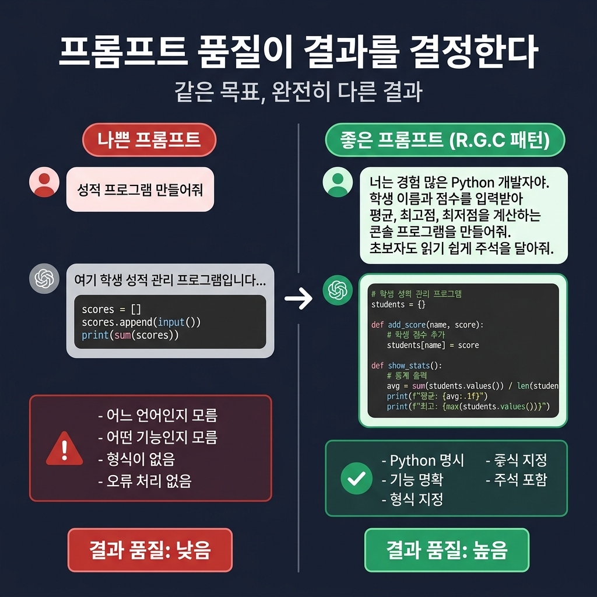
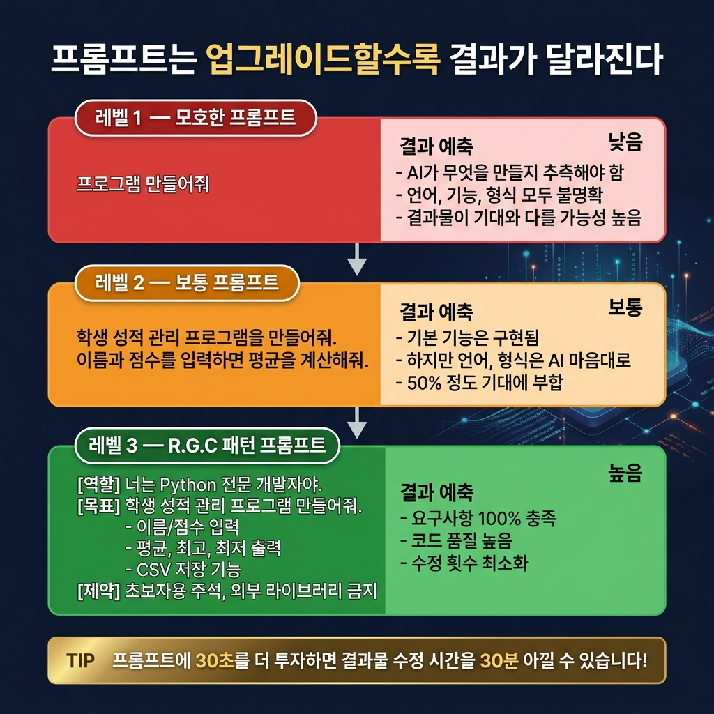
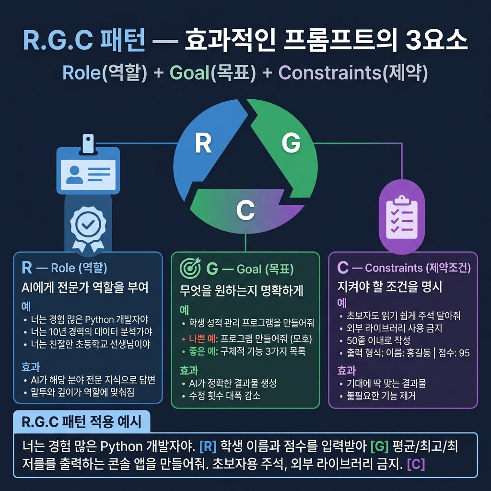
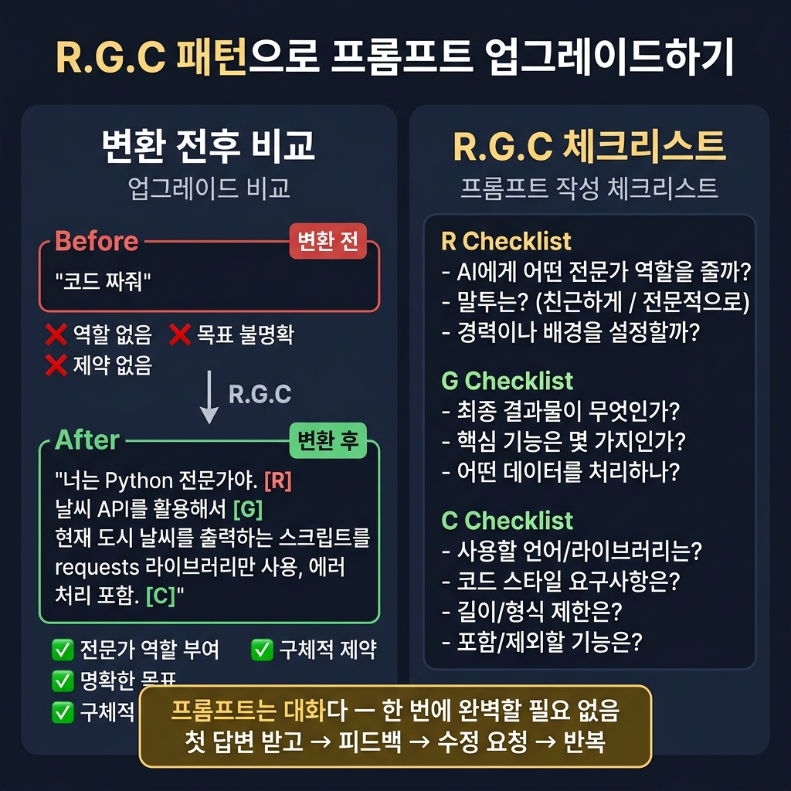

# 📌 4강: 프롬프트 엔지니어링 — AI에게 잘 부탁하는 법

> **핵심 포인트**: 효과적인 프롬프트 작성법 — 역할(Role) + 목표(Goal) + 제약조건(Constraints) 패턴

---

## 📖 이론 (20분)

### 프롬프트란?

AI에게 보내는 **요청 메시지**입니다. 같은 목표라도 프롬프트를 어떻게 쓰느냐에 따라 결과 품질이 크게 달라집니다.

### 나쁜 프롬프트 vs 좋은 프롬프트





같은 목표라도 프롬프트의 품질이 결과를 결정합니다. 위의 두 예시를 보면 차이가 명확합니다.

### R.G.C 패턴





효과적인 프롬프트의 3요소:

| 요소 | 설명 | 예시 |
|------|------|------|
| **R**ole (역할) | AI에게 전문가 역할 부여 | "너는 경험 많은 Python 개발자야" |
| **G**oal (목표) | 무엇을 만들지 명확히 | "학생 성적 관리 프로그램을 만들어줘" |
| **C**onstraints (제약) | 지켜야 할 조건들 | "초보자도 읽기 쉬운 코드로, 주석 포함" |

### 프롬프트 레벨업 팁

1. **구체적으로**: "프로그램" → "Python 콘솔 프로그램"
2. **단계적으로**: 한 번에 큰 덩어리가 아니라, 작은 기능부터 요청
3. **예시를 들어**: "출력 형식은 이렇게 해줘: `이름: 홍길동 | 점수: 95`"
4. **제약을 걸어**: "외부 라이브러리 없이 만들어줘"
5. **수정을 두려워 말기**: "여기서 ~~를 이렇게 바꿔줘" → 대화는 계속된다!

---

## 🔨 가이드 실습 (25분)

### 실습 1: 같은 목표, 다른 프롬프트 (15분)

**목표**: 학생 성적을 관리하는 프로그램

아래 3가지 프롬프트를 **순서대로** 시도하고, 결과를 비교해보세요:

**프롬프트 A** (모호):
```
성적 프로그램 만들어줘
```

**프롬프트 B** (보통):
```
학생 성적을 관리하는 프로그램을 만들어줘.
이름과 점수를 입력하면 평균을 계산해주면 좋겠어.
```

**프롬프트 C** (상세 — R.G.C 패턴 적용):
```
[역할] 너는 교육용 소프트웨어 전문 개발자야.
[목표] 학생 성적 관리 프로그램을 Python으로 만들어줘.
[기능]
- 학생 이름과 국어/영어/수학 3과목 점수를 입력받음
- 학생별 평균, 전체 평균, 최고/최저 점수 표시
- 결과를 보기 좋은 표 형태로 출력
[제약]
- 외부 라이브러리 없이 순수 Python으로
- 초보자가 읽기 쉽게 한글 주석을 충분히 달아줘
- 잘못된 입력(숫자가 아닌 값) 시 다시 입력 요청
```

**비교 포인트**:
- 코드 길이가 어떻게 다른가?
- 에러 처리가 있는가?
- 주석이 있는가?
- 출력이 얼마나 예쁜가?

### 실습 2: 대화로 개선하기 (10분)

프롬프트 C의 결과물에서 이어서:

```
잘 만들었어! 여기에 세 가지를 추가해줘:
1. 90점 이상은 A, 80점 이상은 B... 등급 표시
2. 결과를 CSV 파일로도 저장
3. JavaScript 버전도 만들어줘
```

> 🎵 **바이브코딩의 핵심**: 한 번에 완벽할 필요 없습니다. 대화를 통해 점점 나아지면 됩니다!

---

## 🎯 자율 실습 (25분)

[TOPIC_POOL.md](TOPIC_POOL.md)에서 주제를 골라 **R.G.C 패턴**으로 요청해보세요!

**이번 강의 추천 주제**: 🟡 코드 스타일 지정 실험, 🟡 단계적 지시 vs 한번에 지시 비교

---

## ✅ 이번 강의 체크리스트

- [ ] R.G.C 패턴 (역할+목표+제약조건)을 이해했다
- [ ] 모호한 프롬프트와 구체적 프롬프트의 결과 차이를 체험했다
- [ ] AI와 대화하며 점진적으로 프로그램을 개선할 수 있다
- [ ] 예시와 제약조건을 프롬프트에 포함할 수 있다

---

## 🔗 다음 강의

[5강: 오류와 친해지기](../L05_오류와_친해지기/README.md) — 에러는 적이 아니라 단서입니다
