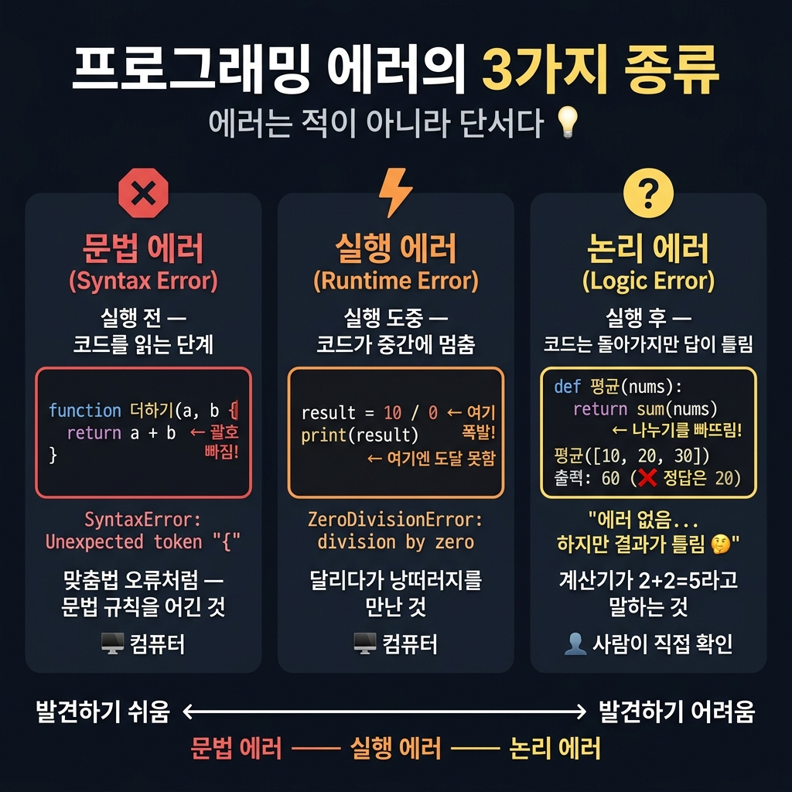
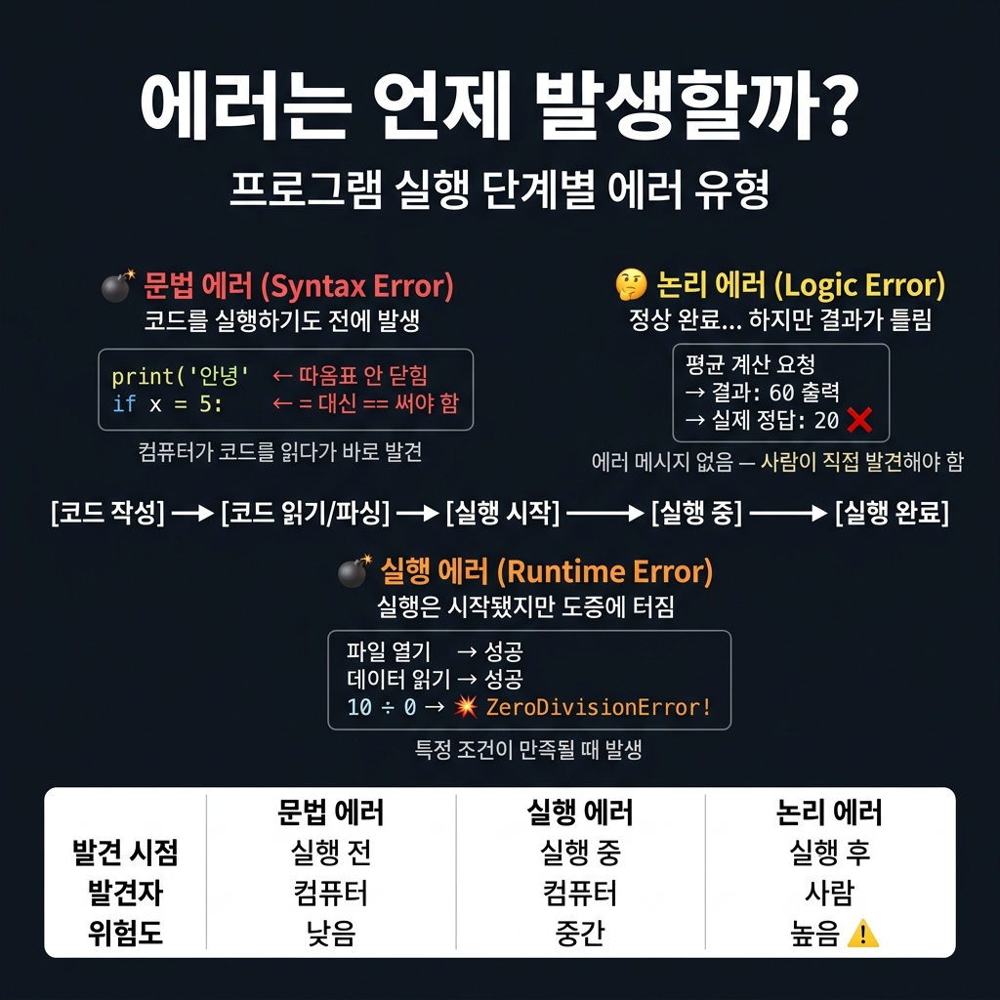
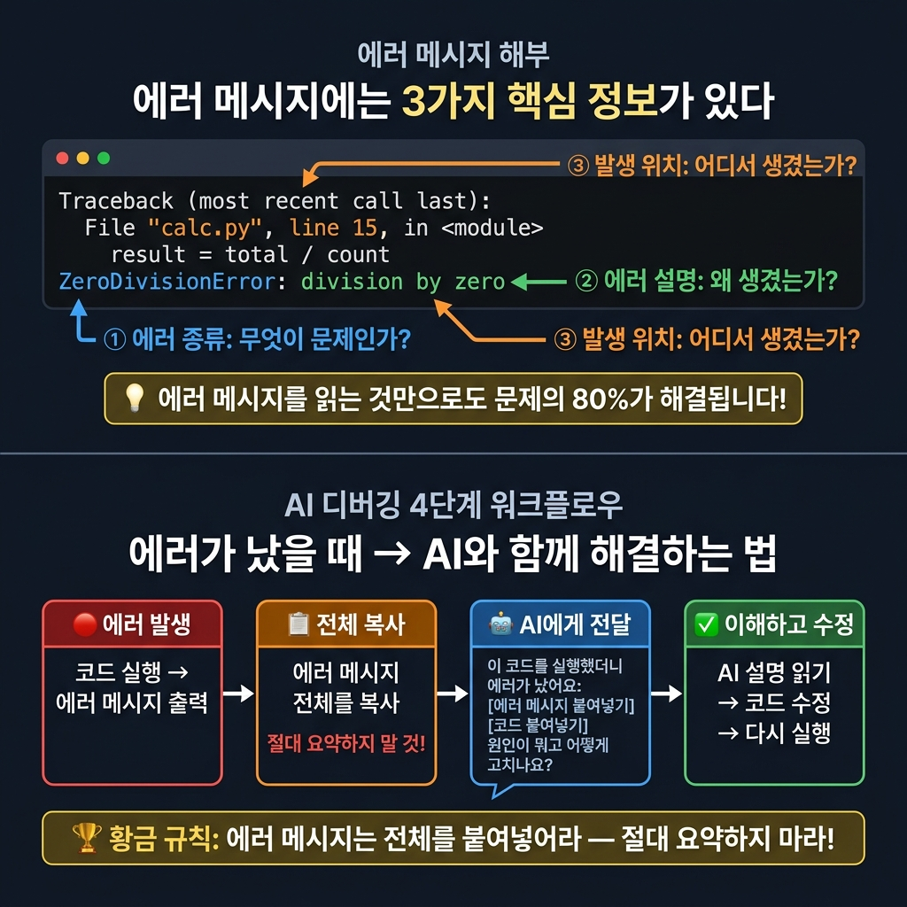
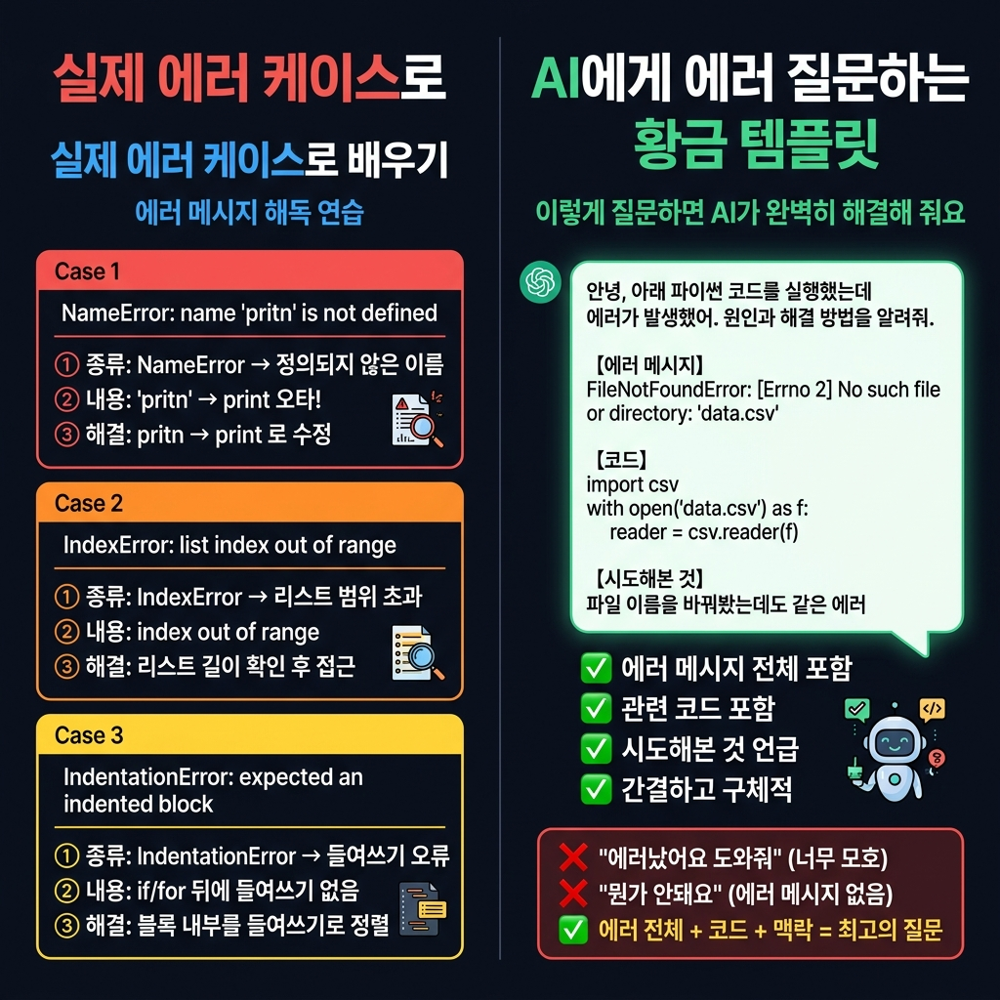

# 📌 5강: 오류와 친해지기 — 에러는 적이 아니라 단서다

> **핵심 포인트**: 에러 메시지의 구조를 읽는 법과 AI를 활용한 디버깅 워크플로우

---

## 📖 이론 (20분)

### 에러는 왜 발생할까?

프로그램이 실행되다가 **예상하지 못한 상황**을 만나면 에러가 발생합니다.

> 💡 에러는 프로그램이 "여기서 문제가 있어요!"라고 알려주는 **신호**입니다.
> 에러를 두려워하지 마세요 — 에러가 없으면 어디가 틀렸는지조차 모릅니다!

### 에러의 3가지 종류





| 종류 | 언제 발생 | 발견 주체 | 예시 |
|------|----------|----------|------|
| **문법 에러** (Syntax Error) | 실행 전, 코드 읽는 단계 | 컴퓨터 | 괄호 안 닫음, 쉼표 빠짐 |
| **실행 에러** (Runtime Error) | 코드 실행 도중 | 컴퓨터 | 파일 없음, 0으로 나누기 |
| **논리 에러** (Logic Error) | 실행은 되지만 결과가 틀림 | **사람** | 평균 구하는데 합만 출력 |

> ⚠️ **논리 에러가 가장 위험합니다** — 에러 메시지가 없어서 직접 찾아야 합니다!

---

### 자주 만나는 에러 유형 사전

#### JavaScript

| 에러명 | 의미 | 흔한 원인 |
|--------|------|----------|
| `ReferenceError` | 선언되지 않은 변수 사용 | 오타, 선언 전 사용 |
| `TypeError` | 잘못된 타입으로 연산 | `undefined.length` 등 |
| `SyntaxError` | 문법 오류 | 괄호 불일치, 쉼표 누락 |
| `RangeError` | 허용 범위 초과 | 배열 범위 초과, 무한 재귀 |
| `URIError` | 잘못된 URI 처리 | `decodeURI()` 잘못된 인자 |

#### Python

| 에러명 | 의미 | 흔한 원인 |
|--------|------|----------|
| `NameError` | 정의되지 않은 이름 사용 | 오타, 선언 전 사용 |
| `TypeError` | 잘못된 타입 연산 | 문자열 + 숫자 등 |
| `IndentationError` | 들여쓰기 오류 | 탭/스페이스 혼용 |
| `IndexError` | 리스트 범위 초과 | `list[10]` (길이 5인데) |
| `KeyError` | 딕셔너리 키 없음 | `dict['없는키']` |
| `ZeroDivisionError` | 0으로 나누기 | `10 / 0` |
| `FileNotFoundError` | 파일 없음 | 경로 오타, 파일 미생성 |

---

### 에러 메시지 읽는 법 & AI 디버깅 워크플로우





에러 메시지에는 항상 **3가지 핵심 정보**가 담겨 있습니다:

```
// JavaScript 에러 예시
ReferenceError: myVariable is not defined
    at Object.<anonymous> (calc.js:15:1)

① 에러 종류:  ReferenceError     → 무슨 문제인지
② 에러 설명:  is not defined     → 왜 발생했는지
③ 위치:       calc.js:15         → 어디서 발생했는지
```

```python
# Python 에러 예시
Traceback (most recent call last):
  File "calc.py", line 15, in <module>
    result = total / count
ZeroDivisionError: division by zero

① 에러 종류:  ZeroDivisionError  → 무슨 문제인지
② 위치:       calc.py, line 15   → 어디서 발생했는지
③ 에러 설명:  division by zero   → 왜 발생했는지
```

### AI 디버깅 황금 프롬프트

```
이 코드를 실행하니 다음 에러가 나와:

[에러 메시지 전체를 그대로 복사 붙여넣기]

코드는 이거야:
[코드 붙여넣기]

원인을 분석하고 수정된 코드를 보여줘.
수정 이유도 설명해줘.
```

> 💡 **황금 규칙**: 에러 메시지를 **요약하지 말고** 전체를 그대로 붙여넣으세요!
> "뭔가 에러가 났어요"보다 실제 에러 메시지가 훨씬 정확한 정보를 줍니다.

---

### 에러 예방 패턴 (방어적 프로그래밍)

좋은 코드는 에러가 나기 **전에** 예방합니다:

**JavaScript 예시:**
```javascript
// ❌ 에러 가능성 있는 코드
function divide(a, b) {
  return a / b;  // b가 0이면 Infinity 반환
}

// ✅ 방어적 코드
function divide(a, b) {
  if (b === 0) {
    return "0으로 나눌 수 없습니다";
  }
  return a / b;
}
```

**Python 예시:**
```python
# ❌ 에러 가능성 있는 코드
def read_file(path):
    with open(path) as f:
        return f.read()

# ✅ 방어적 코드
def read_file(path):
    try:
        with open(path) as f:
            return f.read()
    except FileNotFoundError:
        return f"파일을 찾을 수 없습니다: {path}"
```

---

## 🔨 가이드 실습 (25분)

### 실습 1: 에러 도감 만들기 (10분)

```
JavaScript와 Python으로 아래 에러 유형별 예제 코드를 만들어줘:

1. SyntaxError / IndentationError (문법)
2. ReferenceError / NameError (미정의 변수)
3. TypeError (타입 불일치)
4. 0으로 나누기 에러
5. 파일 없음 에러

각 예제:
- 에러가 발생하는 코드 (주석으로 "여기서 에러 발생" 표시)
- 올바르게 수정된 코드
- 에러 원인 한 줄 설명
```

### 실습 2: 에러 탐정 게임 (10분)

```
의도적으로 버그가 3개 숨겨진 학생 성적 계산 프로그램을 Python으로 만들어줘.
버그 종류: NameError, ZeroDivisionError, 논리 에러(평균 계산 오류)
어떤 버그인지는 알려주지 말고, 코드만 줘.
```

직접 실행해서 에러를 찾고, AI에게 에러 메시지를 붙여넣어 해결해보세요!

```
[에러 메시지 붙여넣기]
위 에러의 원인을 설명하고 수정 방법을 알려줘.
```

### 실습 3: 견고한 코드 만들기 (5분)

```
방금 수정한 프로그램에 아래 방어 코드를 추가해줘:
- 숫자가 아닌 입력 처리 (try/except)
- 0으로 나누기 예외 처리
- 빈 리스트 입력 처리
- 사용자에게 친절한 한국어 에러 메시지 표시
```

---

## 🎯 자율 실습 (25분)

[TOPIC_POOL.md](TOPIC_POOL.md)에서 주제를 골라 도전해보세요!

**이번 강의 추천 주제**: 🟢 에러 패턴 도감 만들기, 🟡 에러 자동 로그 저장기

---

## 📚 에러 대처 치트시트

| 상황 | 할 일 |
|------|-------|
| 에러가 발생했다 | 패닉 ❌ → 에러 메시지 천천히 읽기 ✅ |
| 에러 메시지를 이해 못 하겠다 | AI에게 전체 메시지 붙여넣기 |
| AI 설명도 이해 안 된다 | "더 쉽게 설명해줘" / "초등학생에게 설명하듯" |
| 고쳐도 또 에러가 난다 | 새 에러 메시지를 다시 AI에게 전달 |
| 에러가 없는데 결과가 이상하다 | 논리 에러! 예상 값과 실제 값을 비교 출력 |

---

## ✅ 이번 강의 체크리스트

- [ ] 에러의 3가지 종류(문법/실행/논리)를 이해했다
- [ ] 에러 메시지에서 종류, 설명, 위치를 찾을 수 있다
- [ ] 자주 만나는 에러 이름 5개 이상 알고 있다
- [ ] 에러 메시지를 AI에게 전달하여 해결할 수 있다
- [ ] try/catch(except) 방어 코드의 개념을 안다
- [ ] 에러가 더 이상 무섭지 않다 (!)

---

## 🔗 다음 강의

[6강: CSV 데이터 다루기](../L06_CSV_데이터_다루기/README.md) — 엑셀 없이 표 데이터 관리하기
