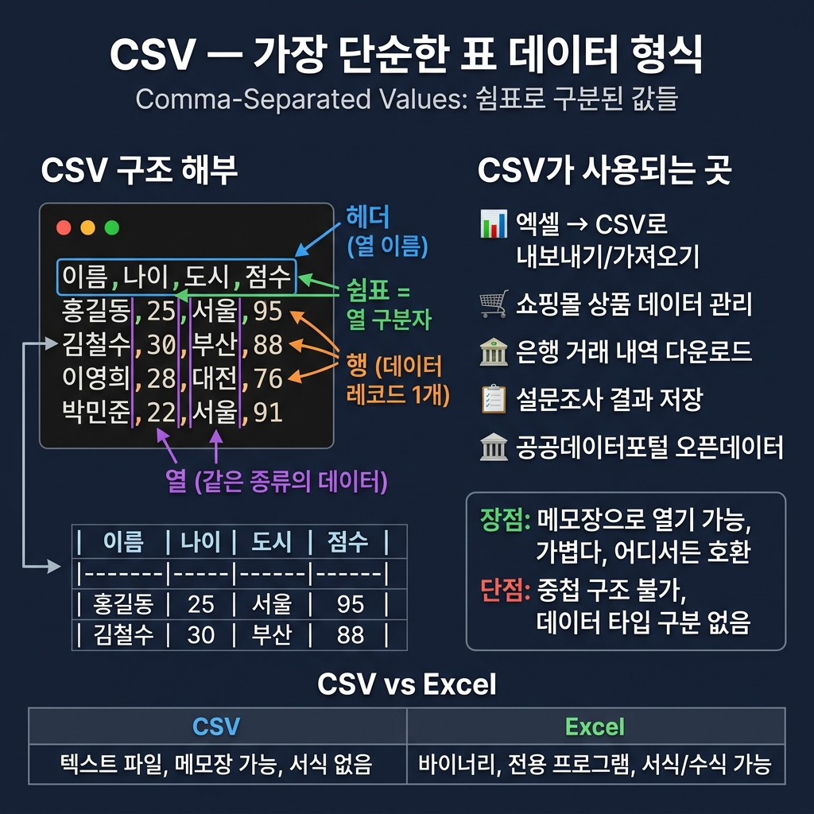
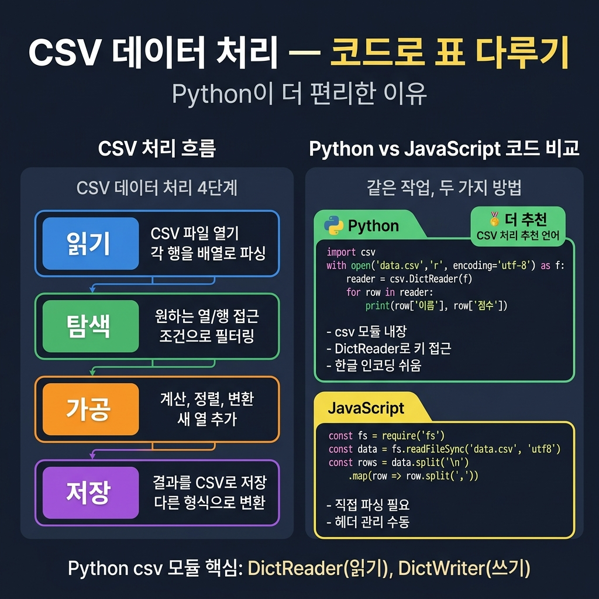

# 📌 6강: CSV 데이터 다루기 — 엑셀 없이 표 데이터 관리하기

> **핵심 포인트**: CSV(Comma-Separated Values) 파일 형식으로 표 데이터를 읽기/쓰기/필터링하기

---

## 📖 이론 (20분)

### CSV란?

가장 단순한 **표(table) 형식** 데이터 파일입니다. 엑셀 파일(.xlsx)과 달리, 메모장으로 열 수 있습니다.

```csv
이름,나이,도시
홍길동,25,서울
김철수,30,부산
이영희,28,대전
```

- 첫 줄: **헤더**(열 이름)
- 각 줄: **행**(하나의 데이터 레코드)
- 쉼표(`,`): **열 구분자**



### CSV가 쓰이는 곳

- 엑셀에서 "다른 이름으로 저장" → CSV 형식
- 쇼핑몰 상품 데이터 내보내기/가져오기
- 은행 거래 내역 다운로드
- 설문조사 결과 데이터
- 기관 공개 데이터(공공데이터포털)

### JavaScript vs Python 비교

```javascript
// JavaScript — fs 모듈 사용
const fs = require('fs');
const data = fs.readFileSync('data.csv', 'utf8');
const rows = data.split('\n').map(row => row.split(','));
```

```python
# Python — csv 모듈 사용 (더 편리!)
import csv
with open('data.csv', 'r', encoding='utf-8') as f:
    reader = csv.DictReader(f)
    for row in reader:
        print(row['이름'], row['나이'])
```



> 💡 CSV 처리는 **Python이 더 편합니다** — 내장 csv 모듈이 강력해요.

---

## 🔨 가이드 실습 (25분)

### 실습 1: CSV 파일 생성 (8분)

```
학생 10명의 성적 데이터를 CSV 파일로 만들어줘:
- 열: 이름, 국어, 영어, 수학, 과학
- 점수는 50~100 사이 랜덤으로
- 파일명: students.csv
- JavaScript와 Python 둘 다
```

### 실습 2: CSV 읽기 + 필터링 (10분)

```
students.csv를 읽어서:
1. 전체 학생 목록을 보기 좋은 표로 출력
2. 국어 점수 80점 이상인 학생만 필터링
3. 각 과목별 평균 점수 계산
4. 결과를 콘솔에 출력하고, honors.csv로도 저장
```

### 실습 3: CSV 수정 (7분)

```
students.csv에 새 열 '평균'과 '등급'을 추가해줘:
- 평균 = 4과목 합계 / 4
- 등급 = A(90↑), B(80↑), C(70↑), D(60↑), F(60↓)
- 수정된 결과를 students_final.csv로 저장
```

---

## 🎯 자율 실습 (25분)

[TOPIC_POOL.md](TOPIC_POOL.md)에서 주제를 골라 도전!

**이번 강의 추천 주제**: 🟢 출석부 자동화, 🟡 두 CSV 파일 병합

---

## ✅ 이번 강의 체크리스트

- [ ] CSV 파일의 구조(헤더, 행, 열 구분자)를 이해했다
- [ ] CSV 파일을 프로그래밍으로 생성할 수 있다
- [ ] CSV에서 특정 조건으로 데이터를 필터링할 수 있다
- [ ] 계산 결과를 새 CSV 파일로 저장할 수 있다

---

## 🔗 다음 강의

[7강: JSON 마스터](../L07_JSON_마스터/README.md) — 데이터의 표준 언어
