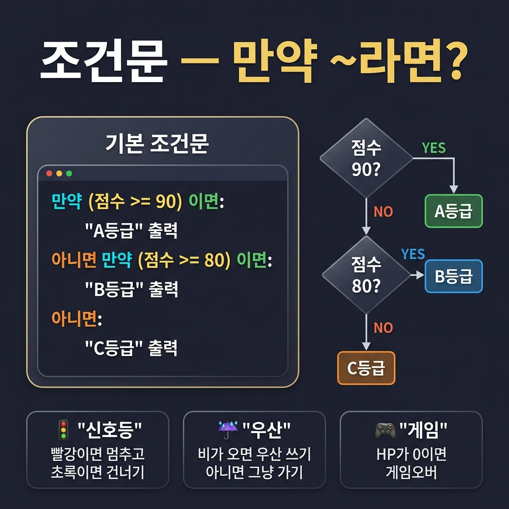
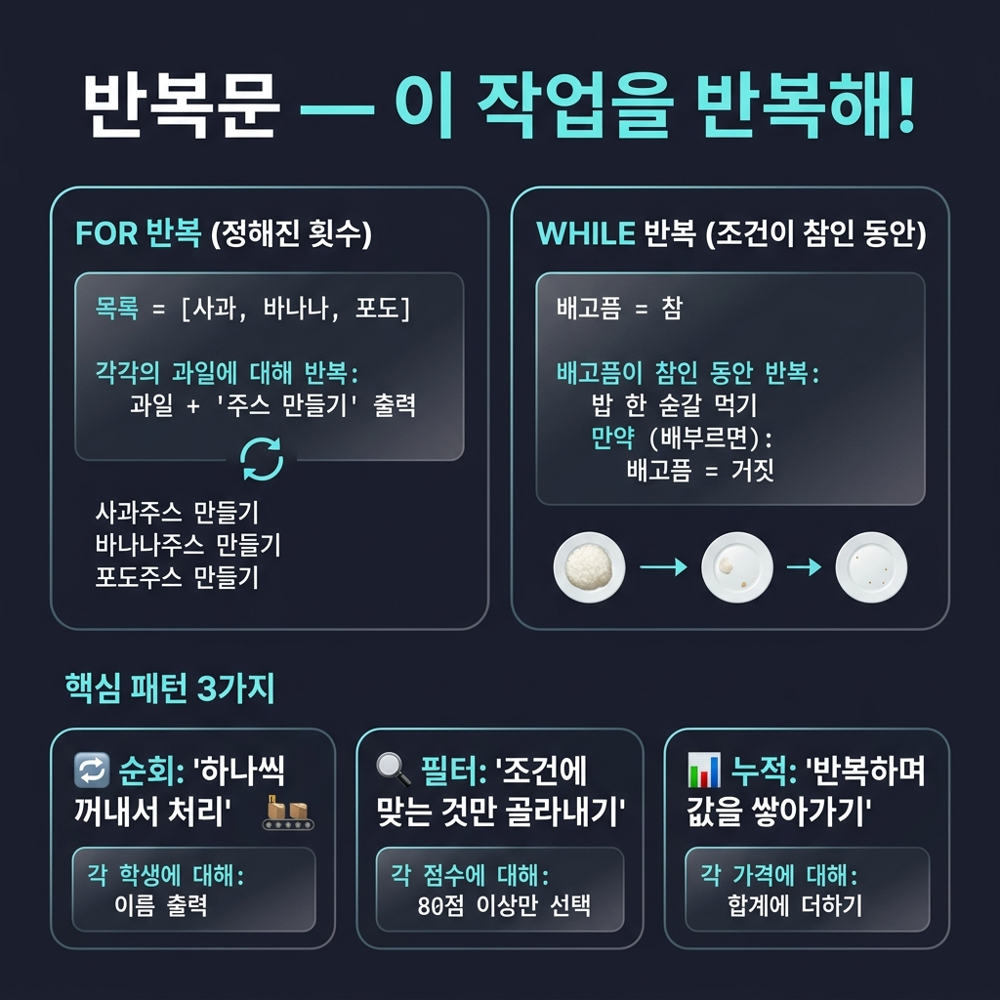

# 📌 9강: 반복과 조건 — 프로그래밍의 핵심 제어 구조

> **핵심 포인트**: "만약 ~이면"과 "~를 반복해" — AI가 만든 코드의 뼈대를 이해하는 열쇠

---

## 📖 이론 (20분)

### 왜 반복과 조건을 알아야 할까?

바이브코딩에서 코드를 직접 쓰지는 않지만, AI가 만든 코드를 **읽고 이해하고 수정 요청**하려면 핵심 구조를 알아야 합니다. 그 핵심이 바로 **반복문**과 **조건문**입니다.

> 💡 여기서는 특정 프로그래밍 언어가 아닌 **의사코드(pseudo code)**로 설명합니다. 개념을 먼저 이해하면, 어떤 언어의 코드든 읽을 수 있습니다!

### 조건문 — "만약 ~라면, ~해라"



조건문은 **상황에 따라 다른 행동을 선택**하는 구조입니다.

```
만약 (점수 >= 90) 이면:
    "A등급" 출력
아니면 만약 (점수 >= 80) 이면:
    "B등급" 출력
아니면:
    "C등급" 출력
```

**일상 속 조건문:**

| 상황 | 조건 | 행동 |
|------|------|------|
| 🚦 신호등 | 빨간불이면 | 멈춘다 |
| 🌂 외출 | 비가 오면 | 우산을 챙긴다 |
| 🎮 게임 | HP가 0이면 | 게임 오버 |
| 🔋 배터리 | 20% 이하이면 | 충전 알림 |

> 조건문의 핵심은 **"분기(갈림길)"** 입니다. 하나의 질문에 '예/아니오'로 답하고, 그에 따라 경로가 달라집니다.

### 반복문 — "이 작업을 반복해!"



반복문은 **같은 작업을 여러 번 수행**하는 구조입니다. 크게 두 종류가 있습니다.

#### 📦 "각각에 대해" 반복 (FOR 반복)

목록에 있는 항목을 **하나씩 꺼내서** 같은 작업을 합니다.

```
과일목록 = [사과, 바나나, 포도]

각각의 과일에 대해 반복:
    과일 + "주스 만들기" 출력
```

결과:
```
→ 사과주스 만들기
→ 바나나주스 만들기
→ 포도주스 만들기
```

#### 🔄 "~하는 동안" 반복 (WHILE 반복)

조건이 **참인 동안** 계속 반복합니다.

```
배고픔 = 참

배고픔이 참인 동안 반복:
    밥 한 숟갈 먹기
    만약 (배부르면):
        배고픔 = 거짓    ← 여기서 반복이 끝남!
```

> ⚠️ WHILE 반복에서 조건이 절대 거짓이 되지 않으면 **무한 반복**에 빠집니다. AI가 만든 코드에서 `while`을 발견하면 "이 반복이 언제 멈추는지" 꼭 확인하세요!

### 핵심 패턴 3가지

반복문과 조건문이 결합되면 세 가지 강력한 패턴이 만들어집니다:

| 패턴 | 의사코드 | 일상 비유 |
|------|----------|-----------|
| 🔄 **순회** | `각 학생에 대해: 이름 출력` | 출석 부르기 — 명단의 이름을 하나씩 읽기 |
| 🔍 **필터** | `각 점수에 대해: 80점 이상만 선택` | 체 거르기 — 큰 것만 걸러내기 |
| 📊 **누적** | `각 가격에 대해: 합계에 더하기` | 저금통 — 동전을 하나씩 넣어 합산 |

#### 필터 패턴 예시

```
학생들 = [홍길동(92), 김철수(75), 이영희(88), 박지민(64)]
우등생목록 = 빈 목록

각각의 학생에 대해 반복:
    만약 (학생의 점수 >= 80) 이면:
        우등생목록에 학생 추가
```

결과: `우등생목록 = [홍길동(92), 이영희(88)]`

#### 누적 패턴 예시

```
가격들 = [1200, 3500, 800, 2200]
총합 = 0

각각의 가격에 대해 반복:
    총합 = 총합 + 가격

"총합은 " + 총합 + "원" 출력
```

결과: `총합은 7700원`

---

## 🔨 가이드 실습 (25분)

### 실습 1: 반복문 체험 (8분)

```
1부터 100까지 숫자 중:
- 3의 배수이면 "Fizz"
- 5의 배수이면 "Buzz"  
- 3과 5의 공배수이면 "FizzBuzz"
- 나머지는 숫자 그대로 출력
하는 프로그램을 만들어줘. (유명한 FizzBuzz 문제!)
```

AI가 만든 코드에서 아래 구조를 찾아보세요:
- 🔄 **반복문**: "1부터 100까지 반복"하는 부분이 어디인가?
- 🔀 **조건문**: "3의 배수인지 판단"하는 부분이 어디인가?
- 📐 **중첩**: 반복문 안에 조건문이 들어있나?

### 실습 2: 의사코드로 먼저 설계하기 (10분)

**먼저 의사코드로 설계한 뒤, AI에게 구현을 요청합니다.**

```
[의사코드 설계]
학생들 = 5명의 학생 데이터 (이름, 국어, 영어, 수학)

각각의 학생에 대해 반복:               ← 순회
    평균 = (국어 + 영어 + 수학) / 3
    이름 + "의 평균: " + 평균 출력

    만약 (평균 >= 90) 이면:            ← 필터 (조건)
        "→ 우등상" 출력
    아니면 만약 (평균 < 60) 이면:
        "→ 보충학습 대상" 출력

[AI에게 프롬프트]
위의 의사코드를 Python으로 구현해줘.
학생 데이터는 JSON 형태로 만들어줘.
```

> 🎵 의사코드로 먼저 로직을 설계하면, AI에게 훨씬 정확한 요구사항을 전달할 수 있습니다!

### 실습 3: 코드 수정 체험 (7분)

실습 2의 결과 코드에서 AI에게 수정을 요청합니다:

```
조건을 바꿔줘:
- 우등상 기준을 95점으로 변경
- 60~70점 구간은 "노력상"으로 분류
- 학생 전체의 과목별 평균도 계산해줘 (누적 패턴!)
- 결과를 JSON 파일로 저장
```

> 🎵 코드의 구조(반복·조건)를 이해하고 있으니, "어디를 어떻게 바꿔달라"고 더 정확하게 요청할 수 있습니다!

---

## 🎯 자율 실습 (25분)

[TOPIC_POOL.md](TOPIC_POOL.md)에서 주제를 골라 도전!

**이번 강의 추천 주제**: 🟢 숫자 맞추기 게임, 🟡 암호 강도 검사기

---

## ✅ 이번 강의 체크리스트

- [ ] 조건문의 개념(만약/아니면)을 말로 설명할 수 있다
- [ ] 반복문의 두 종류(각각에 대해/~하는 동안)를 구분할 수 있다
- [ ] 순회/필터/누적 3가지 패턴을 일상 비유로 설명할 수 있다
- [ ] 의사코드로 먼저 로직을 설계한 뒤, AI에게 구현을 요청할 수 있다
- [ ] AI가 만든 코드에서 조건/반복 부분을 찾아 수정 요청할 수 있다

---

## 🔗 다음 강의

[10강: 텍스트 가공의 힘](../L10_텍스트_가공의_힘/README.md) — 문자열 조작 마스터
